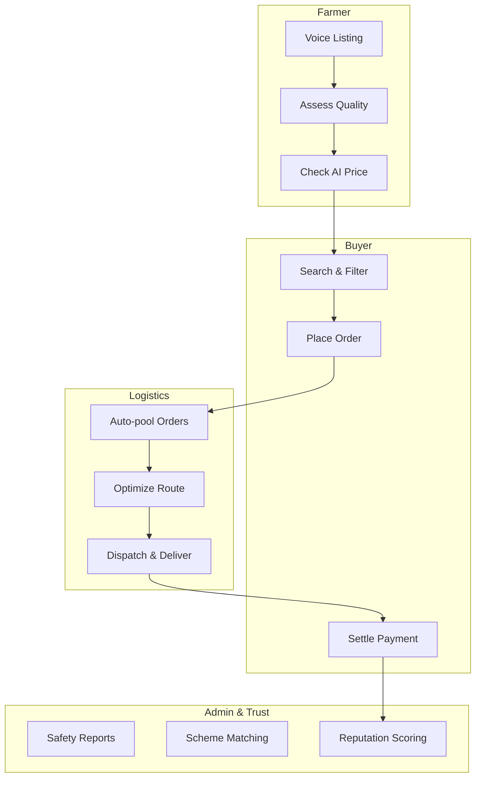
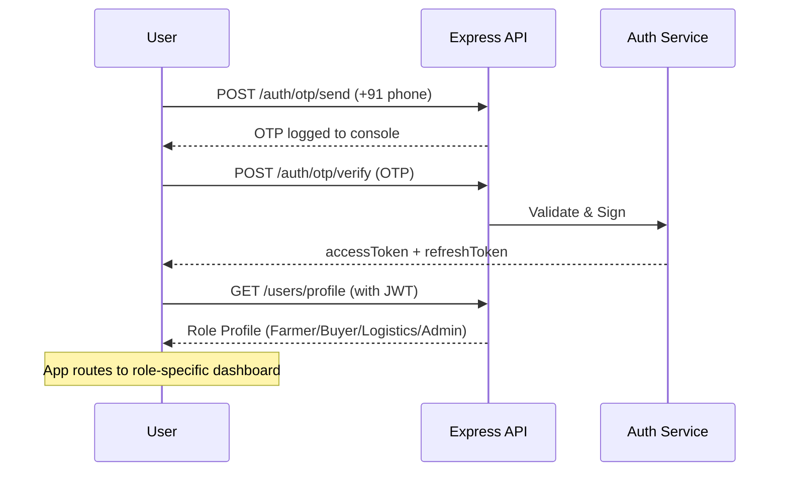
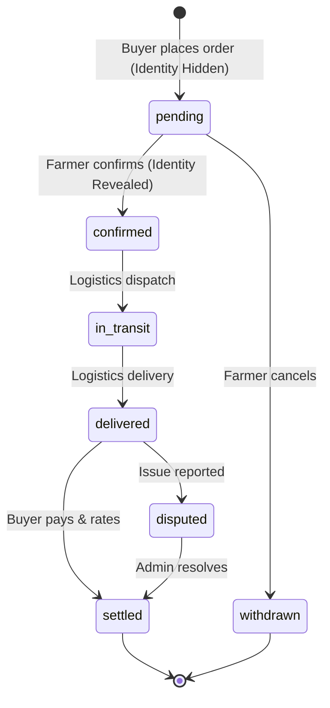

# Kisan Setu (वसुंधरा)

[](https://opensource.org/licenses/MIT)
[]()
[]()
[]()
[]()

**SIH 2026 — Problem Statement IHSIH009 | Team: Bumble Bee 404**

A direct farmgate-to-buyer digital commerce platform designed for low-digital-literacy farmers in regional languages. 

Kisan Setu enables anonymous produce listing, AI-assisted price discovery, produce quality assessment, logistics pooling, financial inclusion via simulated AEPS, and government scheme awareness.

---

## Table of Contents

- [Core Capabilities](#core-capabilities)
- [Problem & Solution](#problem--solution)
- [Ecosystem Flow](#ecosystem-flow)
- [Architecture Overview](#architecture-overview)
- [Implementation Reality](#implementation-reality)
- [Technical Architecture](#technical-architecture)
  - [Frontend](#frontend)
  - [Backend & API](#backend--api)
  - [Data Models](#data-models)
- [Authentication & Order Lifecycle](#authentication--order-lifecycle)
- [Testing](#testing)
- [Setup & Deployment](#setup--deployment)
- [Demo Walkthrough](#demo-walkthrough)
- [Limitations & Future Roadmap](#limitations--future-roadmap)
- [Team](#team)

---

## Core Capabilities

### Marketplace & Logistics
| Capability | Description | Status |
|---|---|---|
| **Anonymous listing** | Publish under `FARM-XXXXX` ID; real identity revealed only at confirmation | Implemented |
| **Order lifecycle** | State machine: pending → confirmed → in_transit → delivered → settled | Implemented |
| **Logistics pooling** | Geo-clustering + nearest-neighbor heuristic (OR-Tools swap-in documented) | Deterministic Fallback |

### AI & Decision Support
| Capability | Description | Status |
|---|---|---|
| **AI price band** | Static Agmarknet baseline (min/fair/max) with confidence & benchmark mandi | Static Baseline |
| **Quality assessment**| Hash-based A/B/C grade with sub-scores — deterministic simulation | Deterministic Fallback |
| **Voice-first UX** | Web Speech API STT/TTS + rule-based NLP in 5 languages (EN/HI/MR/TE/PA) | Deterministic Fallback |

### Financial & Government
| Capability | Description | Status |
|---|---|---|
| **Risk scoring** | Deterministic rule-based model (price volatility, fulfillment, reputation, land) | Deterministic Fallback |
| **Simulated AEPS** | Mock NPCI ref + BC agent + biometric animation — labeled `SIMULATED` | Simulated |
| **Scheme matching** | 18 rule-based schemes (state/crop/land filters) with eligibility reasons | Implemented |

### Safety & Trust
| Capability | Description | Status |
|---|---|---|
| **Safety reporting** | Anonymous whistleblower reports; admin moderation queue | Implemented |
| **Notifications** | Backend event notifications + 30s polling | Implemented |

---

## Problem & Solution

### Problem
Indian smallholder farmers face systemic exploitation in agricultural markets:
- **Information asymmetry**: No access to real-time mandi prices; forced to sell at trader-dictated rates.
- **Intermediary chain**: 3–5 middlemen capture 22–34% of consumer price as margin.
- **No quality standardization**: Produce sold by visual inspection; no objective grading.
- **Cash dependency**: No formal credit access; forced into predatory informal loans.
- **Identity exposure**: Selling requires revealing personal details; enables harassment or cartel pricing.

### Solution: Kisan Setu
A direct farmgate-to-buyer marketplace that eliminates middlemen, ensures fair pricing through AI, and protects farmer identities until the point of sale.

---

## Ecosystem Flow



---

## Architecture Overview

```mermaid
graph TB
    subgraph "Frontend (Vite + React 19 + TS)"
        UI[React SPA]
        Auth[AuthContext + JWT]
        Voice[useVoiceCapture<br/>Web Speech API]
        UI -- HTTPS --> API
    end

    subgraph "Backend (Express + TypeScript)"
        API[Express REST API]
        AuthM[JWT + Role Guards]
        Store[(In-Memory Store<br/>+ Seed Data)]
        Services[Business Logic Services]
    end

    subgraph "External / Simulated"
        Speech[Web Speech API<br/>(Browser STT/TTS)]
        MockAEPS[Simulated AEPS<br/>Mock NPCI Ref]
        MockQuality[Deterministic Quality<br/>Hash-based Grade]
    end

    UI --> Auth
    UI --> Voice
    Voice --> Speech
    Auth --> API
    API --> AuthM
    API --> Store
    API --> Services
    Services --> MockAEPS
    Services --> MockQuality
```

### Tech Stack

| Layer | Implementation |
|---|---|
| **Frontend** | Vite + React 19 + TypeScript (SPA) |
| **Backend** | Express.js + TypeScript (Node 22) |
| **Database** | In-memory singleton store (replaceable with Prisma/Postgres) |
| **Auth** | Phone + OTP (console), JWT (15m/7d) |
| **AI/ML Runtime** | Deterministic rule-based fallbacks (Node/TS) |
| **Voice** | Web Speech API + Rule-based slot-filling |
| **Quality** | Deterministic hash-based simulation |
| **Routing** | Nearest-neighbor heuristic |
| **AEPS** | Simulated AEPS (clearly labeled) |

---

## Implementation Reality

Every "AI" component is a **deterministic, transparent, testable fallback** with a documented swap-in point. No black boxes. No external model serving dependencies in the demo.

| Feature | Classification | Implementation | Production Replacement |
|---|---|---|---|
| **Quality Assessment** | **Deterministic Fallback** | `qualityService.ts`: crop profiles + image hash yields stable grade/sub-scores. No MobileNetV2. | Real model inference (TF.js or Python microservice). |
| **Risk Model** | **Deterministic Fallback** | `riskService.ts`: transparent rule-based formula. No XGBoost inference. | Retrain XGBoost on repayment data; replace `assessRisk()`. |
| **AEPS / Banking** | **Simulated Integration** | `POST /finance/aeps/simulate-cashout` returns mock NPCI ref and BC agent name. | Licensed AEPS/NPCI + bank partner integration. |
| **OR-Tools / VRP** | **Deterministic Fallback** | `logisticsService.optimizeRoute()` uses nearest-neighbor heuristic. | OR-Tools CP-SAT VRP solver (Python microservice). |
| **Voice / Bhashini** | **Deterministic Fallback** | `voiceService.ts` uses Web Speech API (browser STT/TTS) + rule-based slot filling. | Bhashini API adapter. |
| **Market / Price Data** | **Static Baseline** | `marketService.ts` uses 7-crop hardcoded Agmarknet baselines. No live fetch. | Scheduled Agmarknet CSV ingest + Prophet model. |
| **AI Market Insights** | **Deterministic Fallback** | `insightService.ts` aggregates historical price data and provides rule-based AI summaries. | LLM integration for dynamic text generation. |

---

## Technical Architecture

### Frontend
- **Vite 8.3** + **React 19** + **TypeScript 7**
- **Tailwind CSS 4** (via `@tailwindcss/vite`)
- Local-first state management (no Redux); AuthContext for user session.

### Backend & API
- **Express.js 4.21** + **TypeScript 7** + **Node 22**
- Service layer pattern separates business logic from controllers.

#### Key Endpoints
| Method | Endpoint | Auth | Description |
|---|---|---|---|
| POST | `/auth/otp/send` | Public | Send 6-digit OTP to +91 phone (logged to console) |
| POST | `/auth/otp/verify` | Public | Verify OTP -> `{ tokens, user }` |
| GET | `/users/profile` | Required | Role-aware profile (farmer/buyer/logistics) |
| GET | `/listings` | Public | Fetch all active produce listings |
| POST | `/orders` | Buyer | Create order (validates listing active, qty available) |
| GET | `/matching/buyer/:id` | Buyer/Admin | Ranked active listings with `matchScore` and `distanceKm` |
| GET | `/finance/risk/:farmerId`| Farmer/Admin| Returns computed `RiskAssessment` |
| GET | `/schemes/match/:farmerId`| Farmer/Admin| Matched government schemes with `eligibilityReason` |
| GET | `/notifications` | Required | All notifications for current user |
| GET | `/insights/dashboard` | Required | `{ insights: MarketInsight[], summary: string }` |

### Data Models
All types defined in a single source of truth (`src/types.ts` <-> `server/src/types.ts`).

- **FarmerProfile**: Contains `anonSellerId` (e.g., "FARM-88214"), reputation score, and primary crops.
- **Listing**: Public API scrubs `farmerRealName` and `farmerPhone` prior to identity reveal.
- **Order**: Manages lifecycle status. Identity reveal flag determines if seller details are exposed to the buyer.

---

## Authentication & Order Lifecycle

### Authentication Flow
Authentication leverages OTPs with JWT access (15m) and refresh (7d) tokens. Route guards ensure role-based access control.



### Order State Machine
Orders transition through a strict state machine. Identities are strictly protected until the farmer confirms the order.



---

## Testing

- **vitest** + **supertest** for backend testing.
- **255/255 tests pass** across 6 test files covering auth, matching, schemes, finance, insights, and reports.

| Command | Result |
|---|---|
| `npm test` | **PASS** (100% backend test suite) |
| `npm run lint:server` | **PASS** (`tsc --noEmit -p tsconfig.server.json`) |
| `npm run lint` | **PASS** (`tsc --noEmit`) |
| `npm run build` | **PASS** (412 KB JS, 59 KB CSS gzipped) |

---

## Setup & Deployment

### Prerequisites
- Node.js 22+
- npm 10+

### Quick Start
```bash
# Clone & install
npm install

# Terminal 1: Backend (port 4000)
npm run dev:server

# Terminal 2: Frontend (port 3001)
npm run dev
```

The application will be available at `http://localhost:3001`.

### Environment Variables
```bash
# Frontend (Vite)
VITE_API_BASE_URL=http://localhost:4000/api

# Backend (Express)
PORT=4000
JWT_SECRET=vasundhara-dev-secret-change-me
JWT_REFRESH_SECRET=vasundhara-refresh-secret-change-me
FRONTEND_URL=http://localhost:3001
```

---

## Demo Walkthrough

The following 6-minute sequence covers the core functionality across all four roles.

| Time | Action | Role | Screen |
|---|---|---|---|
| 0:00 | Open app → Login as Farmer (Ramesh Patil, `+91 98231 44521`) | Farmer | OTP → Dashboard |
| 0:30 | Voice create listing: *"2 quintal tomato, 18 rupees"* (Marathi) | Farmer | Create Listing Modal |
| 1:00 | Upload photo → Quality Grade A (96%) + AI Price Band ₹16–21 | Farmer | Create Listing Modal |
| 1:30 | Publish → See listing in My Listings as `FARM-88214` | Farmer | Listings Tab |
| 2:00 | Switch to Buyer (Vikram Joshi, `+91 99801 88301`) | Buyer | Marketplace |
| 2:15 | Filter Tomato → See `FARM-88214` at 98% match | Buyer | Marketplace |
| 2:30 | Place order 1000kg @ ₹18/kg → Auto-confirmed | Buyer | Order Modal |
| 3:00 | Switch to Farmer → Orders: ORD-1092 confirmed, identity revealed | Farmer | Orders Tab |
| 3:20 | Switch to Logistics → POOL-NSK-01 in_transit, route map | Logistics | Pool Detail |
| 3:45 | Mark stops complete → Pool delivered | Logistics | Pool Detail |
| 4:00 | Switch to Farmer → Finance: Risk Low (16), Eligible ₹45K | Farmer | Finance Tab |
| 4:20 | Request ₹20K → AEPS modal → Aadhaar 4521 → Biometric → NPCI ref | Farmer | AEPS Modal |
| 4:40 | Switch to Buyer → Settle ORD-1075 → Rate 5 stars | Buyer | Orders Tab |
| 5:00 | Switch to Farmer → Schemes: View matched schemes feed | Farmer | Schemes Tab |
| 5:20 | Safety: Submit anonymous cartel report | Farmer | Safety Tab |
| 5:40 | Switch to Admin → Reports queue → Triaging | Admin | Reports Tab |

### Demo Accounts
OTPs are printed to the backend console (e.g., `[OTP] Phone: +91 98231 44521 | OTP: 292450`).

| Role | Phone | Name | Seed ID |
|---|---|---|---|
| **Farmer** | `+91 98231 44521` | Ramesh Patil | `farmer_1` (FARM-88214) |
| **Buyer** | `+91 99801 88301` | Vikram Joshi | `buyer_1` (Processor, Pune) |
| **Logistics** | `+91 98224 55198` | Kailash Shinde | `logistics_1` (Bolero Pickup, Nashik) |
| **Admin** | `+91 99999 99999` | Admin User | `admin_1` |

---

## Limitations & Future Roadmap

| Area | Description |
|---|---|
| **Database** | In-memory store only — Demo resets on server restart. Prisma/Postgres migration planned. |
| **Granular Data Privacy** | End-to-end encryption for farmer identity and location data before identity reveal. |
| **Real-time Notifications** | WebSocket-based real-time updates replacing 30s polling. |
| **Production Deployment** | Vercel + Railway/Render + Supabase/Neon + CI/CD pipeline. |
| **PWA / Offline Support** | Service worker, cache-first strategy, background sync. |
| **Advanced Voice/NLP** | Bhashini API integration for production-grade multilingual support. |
| **Real AEPS Integration** | Licensed NPCI/BC-agent integration replacing simulated flow. |
| **Rate Limiting & Security** | API rate limiting, structured logging (Sentry), API gateway. |

---

## Team

| Detail | Value |
|---|---|
| **Problem Statement** | IHSIH009 — Direct Farmer-to-Buyer Digital Marketplace |
| **Team Name** | Bumble Bee 404 |
| **SIH Edition** | SIH 2026 |
| **Repository** | Private GitHub (monorepo) |

---

## License

MIT License — See `LICENSE` for details.
