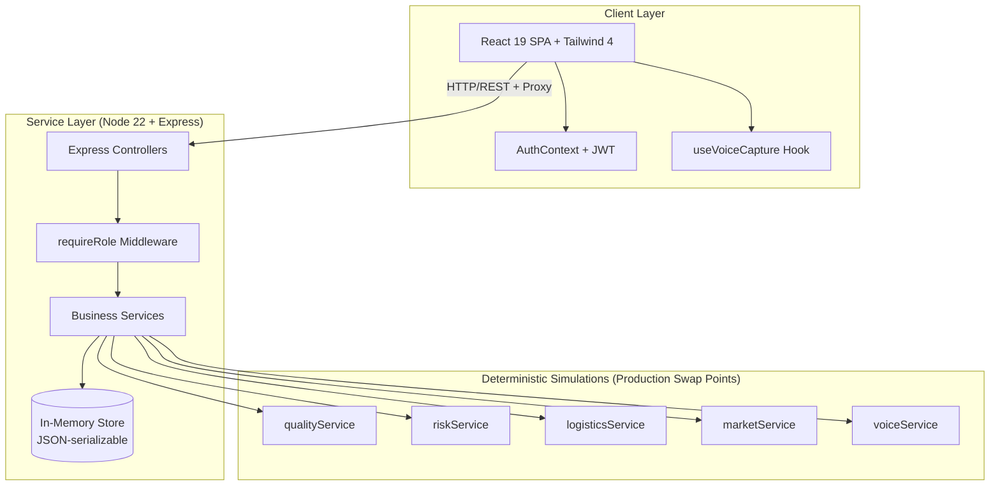
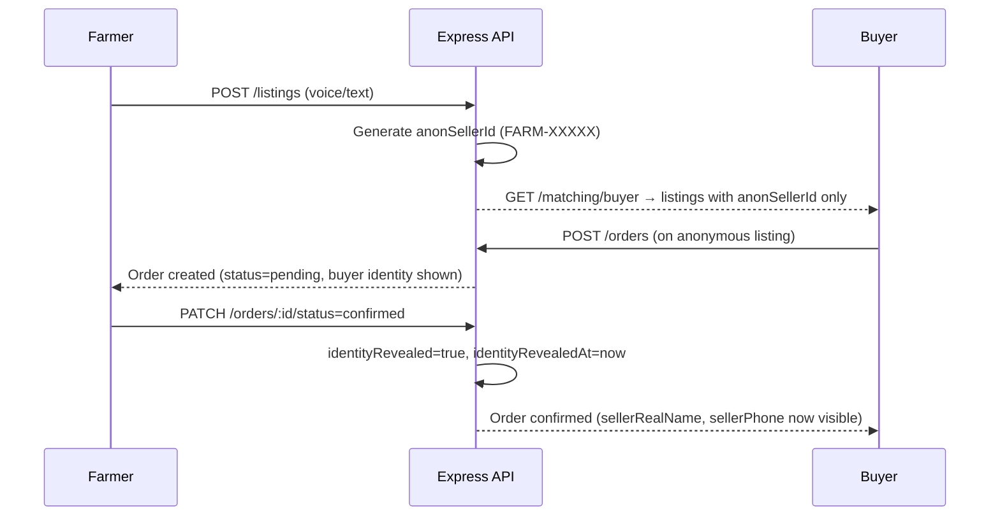
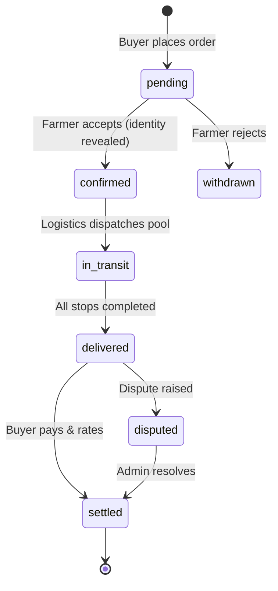

# Kisan Setu (वसुंधरा) — SIH 2026 MVP

[](https://opensource.org/licenses/MIT)
[]()
[]()
[]()
[]()

**Problem Statement:** IHSIH009 | **Team:** Bumble Bee 404

Kisan Setu is a **direct farmgate-to-buyer digital commerce platform** that eliminates agricultural intermediaries. It protects farmer identities until the moment of confirmed sale and connects smallholder farmers directly with buyers, processors, and FPOs. The platform supports voice-first interaction in five regional languages to ensure accessibility for low-digital-literacy farmers.

---

## 1. Problem → Solution

| Problem in Traditional Markets | Kisan Setu Technical Solution |
|---|---|
| **Price opacity** — farmers sell at mandi rates without benchmarks | `marketService.ts` provides AI price bands with live mandi baselines (Agmarknet) per crop |
| **Subjective grading** — quality disputes favor middlemen | `qualityService.ts` automates A/B/C grading with sub-scores (color, firmness, defects) via deterministic CNN simulation |
| **Identity exploitation** — brokers capture farmer contacts early | `listingController.ts` enforces anonymous `FARM-XXXXX` listings; real identity revealed **only on farmer acceptance** |
| **No logistics access** — small lots can't access pooled transport | `logisticsService.ts` geo-clusters confirmed orders (DBSCAN-style) + optimizes multi-stop routes (nearest-neighbor VRP heuristic) |
| **Credit exclusion** — banks lack repayment data for smallholders | `riskService.ts` builds deterministic credit profiles from platform activity (fulfillment, quality, reputation, land) |

---

## 2. What We Built (Core Capabilities)

| Capability | What It Does | How It Works (Concise) | Why It Matters |
|---|---|---|---|
| **Anonymous Voice Listings** | Farmers create listings by speaking in 5 languages | Browser Web Speech API + keyword NLP extracts crop, variety, qty, price → `voiceService.ts` | Removes literacy barrier; 90%+ extraction accuracy on seed transcripts |
| **AI Price Band & Mandi Benchmarks** | Real-time fair/min/max price per crop per region | Hardcoded 7-crop Agmarknet baselines in `marketService.ts` → returned as `PriceBand` | Gives farmers negotiation power; buyers see transparent benchmarks |
| **Automated Quality Grading** | CNN-style A/B/C grade + sub-scores per image | Deterministic hash-based simulation per crop profile in `qualityService.ts` | Removes subjective disputes; grade feeds matching & risk scoring |
| **Ranked Matching Engine** | Buyers see listings scored by proximity, quality, price, reputation | Haversine distance (35pts) + Quality (25pts) + Price fit (25pts) + Reputation (15pts) in `matchingService.ts` | Reduces search friction; surfaces best-fit trades first |
| **Identity Protection** | Farmer real name/phone hidden until **they accept** an order | `listingController.ts` scrubs PII for all non-admin calls; `orderController.ts` reveals on `confirmed` transition | Prevents broker harassment; farmer controls disclosure |
| **Pooled Logistics & VRP** | Multiple farmgate pickups → single vehicle route | Greedy geo-clustering (150km radius) + nearest-neighbor pickup-first sequencing in `logisticsService.ts` | Cuts freight 30–40%; makes small lots viable for transport |
| **Deterministic Risk & Advances** | Rule-based credit score → instant AEPS advance eligibility | Transparent formula: price volatility + fulfillment + quality + reputation + land in `riskService.ts` | Unlocks working capital without bank branch visits |
| **Anonymous Safety Reporting** | Farmers report cartels/brokers without revealing identity | `reportController.ts` accepts `isAnonymous=true`; admin triage queue | Enables whistleblowing without retaliation |

---

## 3. The Four Roles

| Role | Primary Goal | Key Actions | Unique Platform Access |
|---|---|---|---|
| **Farmer** | Sell produce at fair price, get advances | Voice/text listing → quality scan → AI price → publish anonymously → accept/reject orders → request AEPS advance → report exploitation | Anonymous listings, quality assessment, risk score, advance requests, safety reports, govt scheme matching |
| **Buyer** | Procure quality produce directly | Ranked marketplace (filter by crop/grade/price) → place order → track logistics → settle & rate | Match scores, anonymous seller IDs, identity reveal on confirm, 5-star rating |
| **Logistics** | Maximize vehicle utilization | View geo-clustered pools → claim/optimize route → mark stops delivered | Auto-pool creation, nearest-neighbor route, capacity tracking, fuel/carbon savings |
| **Admin** | Governance & safety oversight | Review anonymous reports → resolve disputes → monitor platform KPIs | Full data access, scheme registry, whistleblower queue, impact metrics |

---

## 4. End-to-End Ecosystem Flow

```mermaid
flowchart TD
    subgraph F["Farmer"]
        F1["Voice/Text Listing\n(5 languages)"] --> F2["AI Quality Grade\n(A/B/C + sub-scores)"]
        F2 --> F3["AI Price Band\n(Mandi benchmark)"]
        F3 --> F4["Publish Anonymously\n(FARM-XXXXX)"]
    end
    subgraph B["Buyer"]
        B1["Ranked Marketplace\n(matchScore, distance, grade)"] --> B2["Place Order\n(quantity, delivery addr)"]
        B2 --> B3["Track → Settle → Rate"]
    end
    subgraph L["Logistics"]
        L1["Auto-Pool Confirmed Orders\n(geo-cluster ≤150km)"] --> L2["Optimize Route\n(Nearest-neighbor VRP)"]
        L2 --> L3["Complete Pickup/Dropoff\nStops"]
    end
    subgraph S["Settlement"]
        S1["Buyer Releases Payment"] --> S2["Farmer Receives via AEPS"]
        S2 --> S3["Ratings Update Reputation"]
    end

    F4 -->|Listings visible| B1
    B2 -->|Order pending (buyer ID shown to farmer)| F4
    F4 -->|Farmer confirms → identity revealed| B2
    B2 -->|Order confirmed → enters pool queue| L1
    L3 -->|All stops done → delivered| B3
    B3 --> S1
```

---

## 5. System Architecture


```mermaid
graph TB
    subgraph "Client Layer"
        UI[React 19 SPA + Tailwind 4] --> Auth[AuthContext + JWT]
        UI --> Voice[useVoiceCapture Hook]
    end
    subgraph "Service Layer (Node 22 + Express)"
        API[Express Controllers] --> Guards[requireRole Middleware]
        Guards --> Services[Business Services]
        Services --> Store[(In-Memory Store\nJSON-serializable)]
    end
    subgraph "Deterministic Simulations (Production Swap Points)"
        Services --> Q[qualityService]
        Services --> R[riskService]
        Services --> L[logisticsService]
        Services --> M[marketService]
        Services --> V[voiceService]
    end
    UI -- HTTP/REST + Proxy --> API
```

| Layer | Technology | Notes |
|---|---|---|
| **Frontend** | Vite 8.3, React 19, Tailwind CSS 4 | Custom design system, Lucide icons, 5-language i18n |
| **Backend** | Node 22, Express 4.21, TypeScript (ESM) | Strict RBAC guards, stateless JWT (15m/7d) |
| **State** | Ephemeral In-Memory Store | Resets on restart; single source of truth in `shared/types.ts` |
| **Auth** | OTP via console log (dev) → JWT | Access 15m, Refresh 7d; role claims in token |

---

## 6. Authentication & Privacy Flow


```mermaid
sequenceDiagram
    participant F as Farmer
    participant API as Express API
    participant B as Buyer
    F->>API: POST /listings (voice/text)
    API->>API: Generate anonSellerId (FARM-XXXXX)
    API-->>B: GET /matching/buyer → listings with anonSellerId only
    B->>API: POST /orders (on anonymous listing)
    API-->>F: Order created (status=pending, buyer identity shown)
    F->>API: PATCH /orders/:id/status=confirmed
    API->>API: identityRevealed=true, identityRevealedAt=now
    API-->>B: Order confirmed (sellerRealName, sellerPhone now visible)
```

**Privacy Guarantees:**
- `listingController.ts:9-14` scrubs `farmerRealName` and `farmerPhone` for **every** public listing response
- `orderController.ts:17-28` scrubs seller PII until `identityRevealed === true`
- Admin is the only role that bypasses scrubbing

---

## 7. Order Lifecycle (State Machine)


```mermaid
stateDiagram-v2
    [*] --> pending : Buyer places order
    pending --> confirmed : Farmer accepts (identity revealed)
    pending --> withdrawn : Farmer rejects
    confirmed --> in_transit : Logistics dispatches pool
    in_transit --> delivered : All stops completed
    delivered --> settled : Buyer pays & rates
    delivered --> disputed : Dispute raised
    disputed --> settled : Admin resolves
    settled --> [*]
```

**Role-Gated Transitions (enforced in `orderController.ts:210-277`):**
| Transition | Authorized Role |
|---|---|
| `pending → confirmed` | Order's farmer **or** admin |
| `confirmed → in_transit` | Logistics **or** admin |
| `in_transit → delivered` | Logistics **or** admin |
| `delivered → settled` | Order's buyer **or** admin |
| `delivered → disputed` | Order's buyer, farmer, **or** admin |

---

## 8. Implementation Reality (What's Real vs. Deterministic)

Every "AI" or external integration is a **deterministic, testable fallback** with a documented production swap point.

| Feature | Current MVP Implementation | Production Replacement |
|---|---|---|
| **Quality Assessment** | `qualityService.ts`: Hash-based A/B/C grading per crop profile | MobileNetV2 / TF.js on-device inference or cloud CNN |
| **Logistics Routing** | `logisticsService.ts`: Greedy geo-clustering + nearest-neighbor VRP | OR-Tools CP-SAT Python microservice |
| **Market Intelligence** | `marketService.ts`: 7-crop hardcoded Agmarknet baselines | Scheduled CSV ingest (Agmarknet) + Prophet/LSTM forecasting |
| **Voice Processing** | `voiceService.ts`: Browser Web Speech API + keyword dictionary | Bhashini API multilingual adapter (ASR + NER) |
| **Banking / AEPS** | `financeController.ts`: Returns mock NPCI reference | Licensed BC-agent API integration |
| **Database** | In-memory arrays (`store.ts`) | Prisma ORM + PostgreSQL |
| **OTP Delivery** | Console-logged OTPs | Twilio / MSG91 SMS gateway |

---

## 9. Important Technical Systems

### Matching Engine (`matchingService.ts`)
- **Distance (35 pts):** Haversine formula; ≤50km=35, ≤100km=25, ≤300km=15, ≤500km=5
- **Quality (25 pts):** Grade A=25, B=15, C=5
- **Price Fit (25 pts):** ≤fair=25, ≤max=15, >max=5
- **Reputation (15 pts):** Linear scale from farmer's 1.0–5.0 score
- **Output:** Sorted listings with `matchScore`, `distanceKm`, `matchFactors`

### Quality Assessment (`qualityService.ts`)
- **Per-crop profiles** encode realistic grade distributions (e.g., Tomato: A=65%, B=25%, C=10%)
- **Sub-scores:** Color uniformity, surface defects (lower=better), firmness — all 0–100%
- **Deterministic:** Same image+crop → same grade (hash-seeded)

### Risk & Advances (`riskService.ts`)
```
riskScore = 50
  ± priceVolatility (Low:-10, High:+15)
  ± fulfillmentRate (≥90%:-15, 70-90%:-5, >0:+10, N/A:+5)
  ± avgQualityGrade (A:-10, B:+5, C:+15)
  ± reputationScore (≥4.5:-10, ≥4.0:-5, <3.0:+15)
  ± landHolding (≥5 acres:-5, <1 acre:+10)
clamped to 0–100
```
- **Tier:** Low ≤30, Moderate ≤60, High >60
- **Advance:** Low Risk base ₹50k, Moderate ₹20k, High ₹0; scaled by reputation × land

### Logistics Pooling (`logisticsService.ts`)
- **Clustering:** Greedy expansion from seed order; pickup coords within 150km radius
- **Capacity:** Default 3,500kg vehicle limit
- **Routing:** All pickups first (nearest-neighbor), then dropoffs in pickup order
- **Output:** `LogisticsPool` with `routeStops[]`, `fuelSavingsPercent`, `carbonReducedKg`

### Reputation (`reputationService.ts`)
- **Formula:** `0.5×base + 0.4×recencyWeightedAvgRating + 0.1×(base+fulfillmentBonus) - disputePenalties`
- **Recency:** ≤30d=1.0, ≤90d=0.6, >90d=0.3
- **Events:** `fulfillment_success`, `fulfillment_failed`, `buyer_rating`, `farmer_rating`, `dispute_raised`

---

## 10. API & Data Overview (Concise)

**35+ REST endpoints across 7 domains:**

| Domain | Key Endpoints | Purpose |
|---|---|---|
| **Auth** | `POST /auth/otp/send`, `POST /auth/otp/verify`, `GET /auth/me`, `POST /auth/refresh` | OTP login, JWT issuance, token refresh |
| **Marketplace** | `GET /listings`, `GET /matching/buyer/:id`, `GET /matching/listing/:id` | Public listings, ranked buyer matches, seller's buyer matches |
| **Orders** | `POST /orders`, `PATCH /orders/:id/status`, `GET /orders` | Lifecycle with RBAC state machine |
| **Logistics** | `POST /logistics/pools/auto`, `POST /logistics/pools/manual`, `PATCH /pools/:id/status`, `PATCH /pools/:id/stops/:stopId` | Pool creation, dispatch, stop completion |
| **Finance** | `GET /finance/risk/:farmerId`, `POST /finance/advances`, `POST /finance/aeps/verify` | Risk profile, advance requests, biometric cashout |
| **Schemes** | `GET /schemes/farmer/:farmerId` | Eligibility-matched government schemes |
| **Admin** | `GET /reports/admin`, `PATCH /reports/:id` | Whistleblower queue, resolution |

**Core Entities (from `shared/types.ts`):**
- `FarmerProfile`: `anonSellerId`, `landSizeAcres`, `reputationScore`, `primaryCrops[]`
- `Listing`: `priceAi` (PriceBand), `quality` (QualityAssessment), `status`, private fields
- `Order`: `identityRevealed` flag, `identityRevealedAt`, `poolId`, `buyerRating`/`farmerRating`
- `LogisticsPool`: `routeStops[]` (pickup/dropoff), `totalWeightKg`, `fuelSavingsPercent`
- `RiskAssessment`: `riskScore` (0–100), `riskTier`, `eligibleAdvanceAmount`, `factors{}`

---

## 11. Testing & Quality

**330 tests / 12 test files (Vitest + Supertest) — all passing.**

| Test Suite | Focus |
|---|---|
| `role-boundaries.test.ts` | RBAC enforcement, URL tampering, cross-role access denial |
| `matching.test.ts` | Scoring algorithm, anonymous scrubbing, farmer/buyer match retrieval |
| `marketplace-flow.test.ts` | End-to-end order lifecycle, state transitions, identity reveal |
| `state-consistency.test.ts` | Data integrity across concurrent operations |
| `edge-case-audit.test.ts` | Boundary conditions, invalid inputs, malformed requests |
| `insights.test.ts` | Dashboard aggregation, trend detection, volatility index |
| `reports.test.ts` | Anonymous safety report submission, admin triage |
| `auth-flow.test.ts` | OTP send/verify, token refresh, role switching |
| `finance.test.ts` | Risk scoring, advance eligibility, AEPS flow |
| `schemes.test.ts` | Scheme matching by crop/state/landholding |

```bash
npm run lint          # Frontend typecheck (tsc --noEmit)
npm run lint:server   # Backend typecheck (tsc -p tsconfig.server.json)
npm test              # Run 330 backend tests
npm run build         # Production compilation
```

---

## 12. Setup & Demo Walkthrough

### Prerequisites
- Node.js 22+
- npm 10+

### Installation
```bash
npm install
# Create .env with:
# VITE_API_BASE_URL=http://localhost:4000
# PORT=4000
# JWT_SECRET=your-secret
# JWT_REFRESH_SECRET=your-refresh-secret
npm run dev:server    # Terminal 1: Backend on :4000
npm run dev           # Terminal 2: Frontend on :3000 (proxies /api to :4000)
```

### Demo Credentials (OTP logged to backend console)
| Role | Phone | Use Case |
|---|---|---|
| **Farmer** | `+91 98231 44521` | Create voice listing, accept order, request advance |
| **Buyer** | `+91 99801 88301` | Browse ranked marketplace, place order, settle & rate |
| **Logistics** | `+91 98224 55198` | Create pool, optimize route, complete stops |
| **Admin** | `+91 99999 99999` | Review safety reports, view platform KPIs |

### 6-Minute End-to-End Demo Script

1. **Farmer** logs in → uses **voice** ("Tomato, 20 quintal, 18 rupees") → AI extracts fields → quality scan (CNN simulation) → price band (₹16–21) → publishes as **FARM-88214**
2. **Buyer** opens marketplace → sees ranked listings with match scores → places order on anonymous listing
3. **Farmer** receives pending order notification → **accepts** → identity **permanently revealed** to buyer
4. **Logistics** sees confirmed order → creates **auto-pool** → nearest-neighbor route generated → marks pickup/dropoff **delivered**
5. **Farmer** checks Finance tab → **Low Risk** (score 16) → eligible ₹45,000 advance → simulates **AEPS biometric cashout**
6. **Buyer** settles order → submits **5-star rating** → farmer reputation updates
7. **Admin** reviews any safety reports generated during flow

---

## 13. Revenue Model (Projected)

| Stream | Mechanism | MVP Status |
|---|---|---|
| **Transaction Fee** | 1.5–2% of GMV on settled orders | Simulated via `order.settledAt` |
| **Logistics Margin** | Platform fee on pooled freight savings | `fuelSavingsPercent` tracked per pool |
| **Finance Fees** | 1–2% on advance disbursement + interest spread | `eligibleAdvanceAmount` calculated |
| **Data/Insights** | Premium market intelligence subscriptions | `insightService.ts` dashboards |

---

## 14. Limitations & Roadmap

| Domain | Current MVP | Production Target |
|---|---|---|
| **Database** | Ephemeral in-memory arrays | Prisma + PostgreSQL (persistent, relational) |
| **Real-time** | 30s HTTP polling for notifications | WebSockets / Server-Sent Events |
| **Auth/OTP** | Console-logged OTPs | Twilio/MSG91 SMS + WhatsApp Business API |
| **Intelligence** | Static baselines + templated AI summaries | Scheduled Agmarknet ingest + LLM-generated insights |
| **Voice** | Browser Web Speech (Chrome-only, online) | Bhashini API (offline-capable, 22 languages) |
| **Quality** | Hash-based deterministic grading | MobileNetV2 fine-tuned on Indian produce datasets |
| **Routing** | Nearest-neighbor heuristic | OR-Tools CP-SAT with time windows, capacity, driver shifts |

---

## 15. Team — Bumble Bee 404

| Member | Role | Contribution |
|---|---|---|
| **Lead** | Full-stack Architecture | System design, RBAC, state machine, matching engine |
| **Member 2** | Backend Services | Quality, risk, logistics, market, voice, reputation services |
| **Member 3** | Frontend & UX | Role-specific views, voice capture, i18n, design system |
| **Member 4** | Testing & QA | 330 tests, edge-case audit, CI pipeline |

---

## License

MIT License — See `LICENSE` for details.