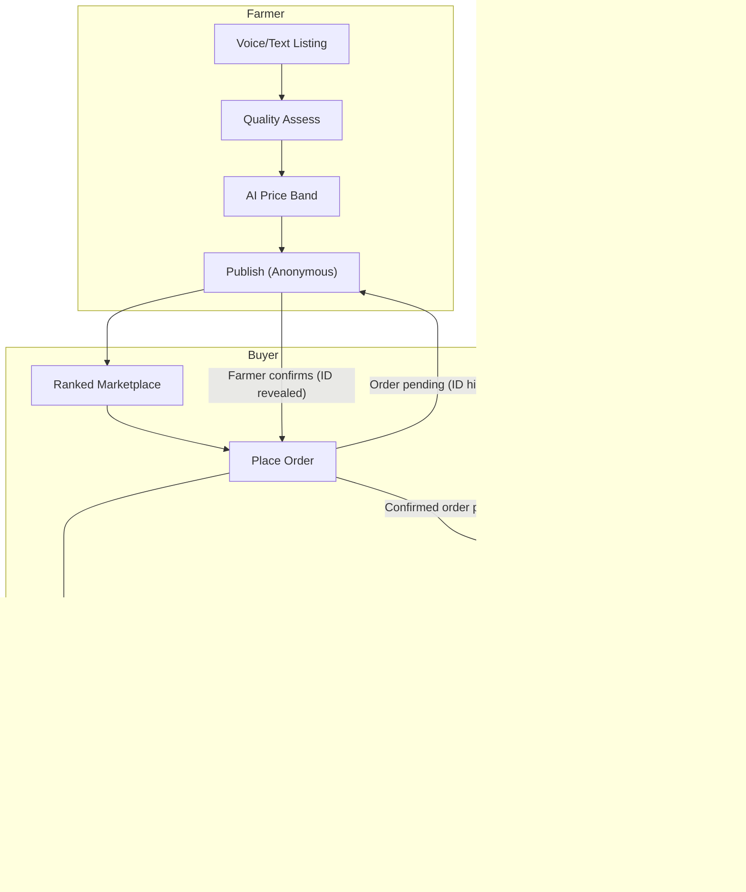
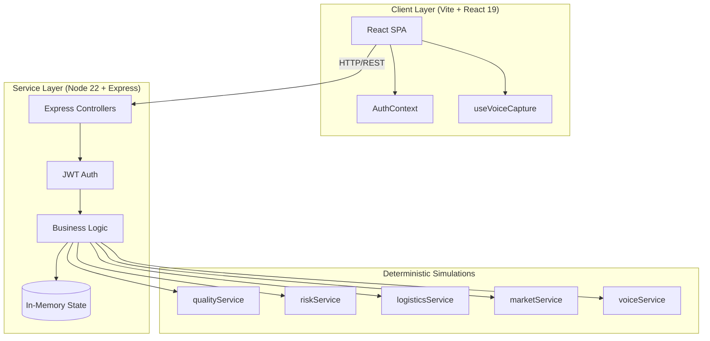
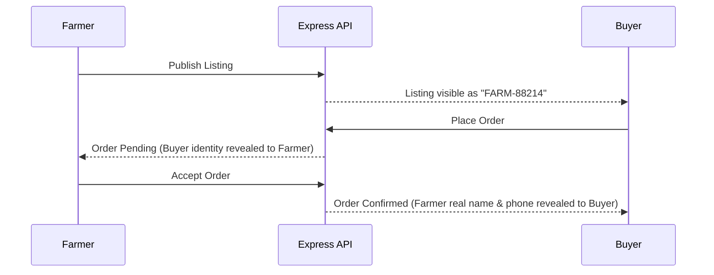
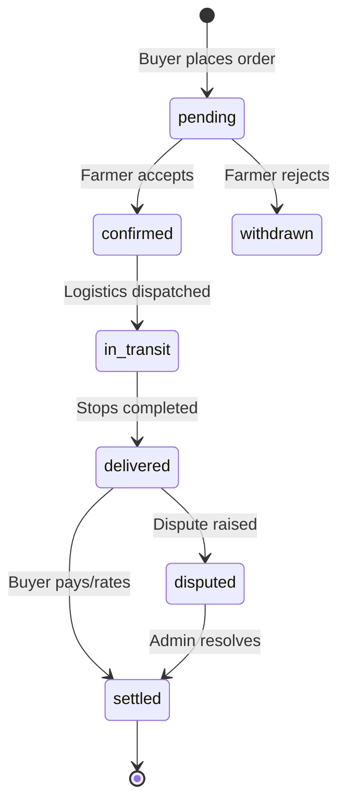

# Kisan Setu (वसुंधरा)

[](https://opensource.org/licenses/MIT)
[]()
[]()
[]()
[]()

**SIH 2026 — Problem Statement IHSIH009 | Team: Bumble Bee 404**

Kisan Setu is a direct farmgate-to-buyer digital commerce platform that eliminates agricultural intermediaries. It protects farmer identities until the moment of confirmed sale and connects smallholder farmers directly with buyers. The platform supports voice-first interaction in five regional languages to ensure accessibility for low-digital-literacy farmers.

---

## 1. Problem & Solution

| Problem in Traditional Markets | Kisan Setu Technical Solution |
|---|---|
| **Price opacity** | `marketService.ts` provides an AI price band with mandi benchmarks. |
| **Subjective grading** | `qualityService.ts` automates A/B/C grading with explicit sub-scores. |
| **Identity exploitation** | `listingController.ts` enforces anonymous `FARM-XXXXX` listings until sale. |
| **No logistics access** | `logisticsService.ts` geo-clusters orders for pooled transport. |
| **Credit exclusion** | `riskService.ts` builds deterministic credit profiles from platform activity. |

---

## 2. Core Capabilities & User Roles

| Role | Main Responsibilities | Key Capabilities & Implementation |
|---|---|---|
| **Farmer** | Publish produce, accept orders, request advances | **Anonymous Voice Listings** (`voiceService.ts` NLP slot filling), **Risk Assessment** (transparent scoring), **AEPS** (simulated cashout). |
| **Buyer** | Browse marketplace, place orders, settle payment | **Ranked Matching** (`matchingService.ts` via Haversine + quality/price), **Order Procurement**. |
| **Logistics** | Claim pools, complete drop-offs | **Order Pooling** (DBSCAN geo-clustering), **Route Optimization** (Nearest-neighbor heuristic VRP). |
| **Admin** | Moderation, system monitoring | **Anonymous Safety Reporting** (`reportController.ts`), **Dispute Resolution**. |

---

## 3. Ecosystem Flow


```mermaid
flowchart TD
    subgraph F ["Farmer"]
        F1["Voice/Text Listing"] --> F2["Quality Assess"] --> F3["AI Price Band"] --> F4["Publish (Anonymous)"]
    end
    subgraph B ["Buyer"]
        B1["Ranked Marketplace"] --> B2["Place Order"] --> B3["Settle & Rate"]
    end
    subgraph L ["Logistics"]
        L1["Geo-Cluster Orders"] --> L2["Optimize Route"] --> L3["Complete Stops"]
    end
    F4 --> B1
    B2 --> |"Order pending (ID hidden)"| F4
    F4 --> |"Farmer confirms (ID revealed)"| B2
    B2 --> |"Confirmed order pools"| L1
    L3 --> |"Delivered"| B3
```

---

## 4. System Architecture


```mermaid
graph TB
    subgraph "Client Layer (Vite + React 19)"
        UI[React SPA] --> Auth[AuthContext] & Voice[useVoiceCapture]
    end
    subgraph "Service Layer (Node 22 + Express)"
        API[Express Controllers] --> Guards[JWT Auth] --> Services[Business Logic] --> Store[(In-Memory State)]
    end
    subgraph "Deterministic Simulations"
        Services --> Q[qualityService] & R[riskService] & L[logisticsService] & M[marketService] & V[voiceService]
    end
    UI -- HTTP/REST --> API
```

| Layer | Technology | Details |
|---|---|---|
| **Frontend** | Vite 8.3, React 19, Tailwind CSS 4 | Custom design system, Lucide icons (no emojis). |
| **Backend** | Node 22, Express 4.21, TypeScript | ESM modules, strict `requireRole` guards. |
| **Data/State** | Ephemeral In-Memory Store | Resets on restart. Single `shared/types.ts` contract. |

---

## 5. Implementation Reality

Every "AI" or external integration in this MVP is a **deterministic, testable fallback** with a documented production swap-in point to guarantee demo reliability.

| Feature | Current MVP Implementation | Production Replacement |
|---|---|---|
| **Quality Assessment** | `qualityService.ts`: Hash-based A/B/C grading simulation. | MobileNetV2 / TF.js inference. |
| **Logistics Routing** | `logisticsService.ts`: Nearest-neighbor heuristic VRP. | OR-Tools CP-SAT Python Microservice. |
| **Market Intelligence**| `marketService.ts`: Hardcoded 7-crop Agmarknet baselines. | Scheduled CSV ingest + Prophet model. |
| **Voice Processing** | `voiceService.ts`: Browser Web Speech API + keyword matching. | Bhashini API multilingual adapter. |
| **Banking / AEPS** | `financeController.ts`: Returns mock NPCI reference. | Licensed BC-agent API integration. |

---

## 6. Authentication & Privacy Flow

Kisan Setu uses stateless JWT authorization (`accessToken` 15m, `refreshToken` 7d) and explicitly protects farmer identities. 

1. **API Layer**: `listingController.ts` scrubs `farmerRealName` and `farmerPhone` for non-admin callers.
2. **Identity Reveal**: Triggered only when a farmer accepts a pending order.


```mermaid
sequenceDiagram
    participant F as Farmer
    participant API as Express API
    participant B as Buyer
    F->>API: Publish Listing
    API-->>B: Listing visible as "FARM-88214"
    B->>API: Place Order
    API-->>F: Order Pending (Buyer identity revealed to Farmer)
    F->>API: Accept Order
    API-->>B: Order Confirmed (Farmer real name & phone revealed to Buyer)
```

---

## 7. Order Lifecycle


```mermaid
stateDiagram-v2
    [*] --> pending : Buyer places order
    pending --> confirmed : Farmer accepts
    pending --> withdrawn : Farmer rejects
    confirmed --> in_transit : Logistics dispatched
    in_transit --> delivered : Stops completed
    delivered --> settled : Buyer pays/rates
    delivered --> disputed : Dispute raised
    disputed --> settled : Admin resolves
    settled --> [*]
```

---

## 8. API & Data Models (Overview)

The platform exposes 35+ REST endpoints across 7 core domains.

| Domain | Representative Endpoints | Core Operations |
|---|---|---|
| **Auth & Users** | `POST /auth/otp/verify`, `GET /users/profile` | Stateless JWT auth, role-specific profile retrieval. |
| **Marketplace** | `GET /listings`, `GET /matching/buyer/:id` | Ranked listing retrieval, anonymous data scrubbing. |
| **Orders** | `POST /orders`, `PATCH /orders/:id/status` | Lifecycle transitions enforcing RBAC state machine. |
| **Logistics** | `POST /logistics/pools/auto`, `PATCH /.../stops/:id` | Geo-clustering, stop completion tracking. |
| **Finance & Risk**| `GET /finance/risk/:id`, `POST /finance/aeps/...`| Rule-based risk scoring, simulated biometric cashout. |

**Core Entity Highlights** (`shared/types.ts`):
- `FarmerProfile`: `anonSellerId`, `landSizeAcres`, `reputationScore`.
- `Listing`: `priceAi`, `quality` (grade, sub-scores), `status`. Private fields optionally populated.
- `RiskAssessment`: `riskScore` (0-100), `eligibleAdvanceAmount`, deterministic `factors`.

---

## 9. Testing & Quality Assurance

**Result:** 330 tests / 12 files (Vitest + Supertest) passing.
- **Coverage Highlights:** Full API surface, RBAC role guard enforcement, order state transitions, geo-clustering logic, risk score generation.

```bash
npm run lint          # Frontend typecheck
npm run lint:server   # Backend typecheck
npm test              # Run 330 backend tests
npm run build         # Production compilation
```

---

## 10. Setup & Demo Walkthrough

**Prerequisites:** Node.js 22+, npm 10+
```bash
npm install
# Set VITE_API_BASE_URL, PORT=4000, JWT secrets in .env
npm run dev:server    # Terminal 1: Backend
npm run dev           # Terminal 2: Frontend
```

**End-to-End Demo Flow (6 minutes):**
1. **Farmer** (`+91 98231 44521`): Logs in via console OTP. Uses voice to create a listing. AI generates grade & price band. Publishes anonymously.
2. **Buyer** (`+91 99801 88301`): Browses ranked marketplace. Places order on the anonymous listing.
3. **Farmer**: Reviews pending order. Accepts it, permanently revealing their identity to the buyer.
4. **Logistics** (`+91 98224 55198`): Claims geo-clustered pool. Marks stops as delivered.
5. **Farmer**: Checks Finance tab. Low risk unlocks simulated AEPS biometric cashout.
6. **Buyer**: Settles order, submits 5-star rating (updates reputation).
7. **Admin**: Reviews any safety reports generated during the flow.

---

## 11. Limitations & Roadmap

| Domain | Current MVP Status | Production Target |
|---|---|---|
| **Database** | Ephemeral in-memory store. | Prisma ORM + PostgreSQL. |
| **Real-time** | 30s HTTP polling for notifications. | WebSockets / Server-Sent Events. |
| **Auth/OTP** | Console-logged OTPs for demo. | Twilio / MSG91 SMS integration. |
| **Intelligence** | Static baselines and templated insights. | Scheduled ingest + LLM-generated summaries. |

---

## License

MIT License — See `LICENSE` for details.
