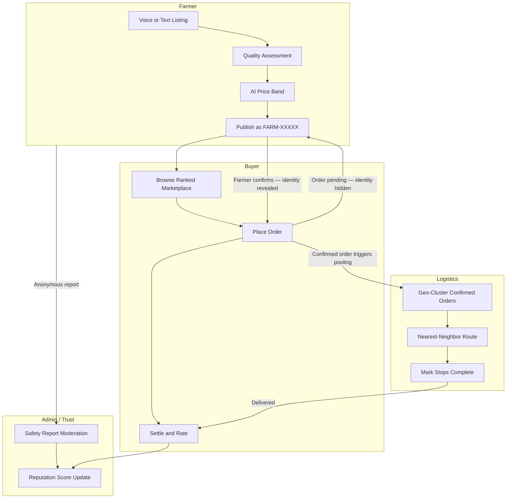
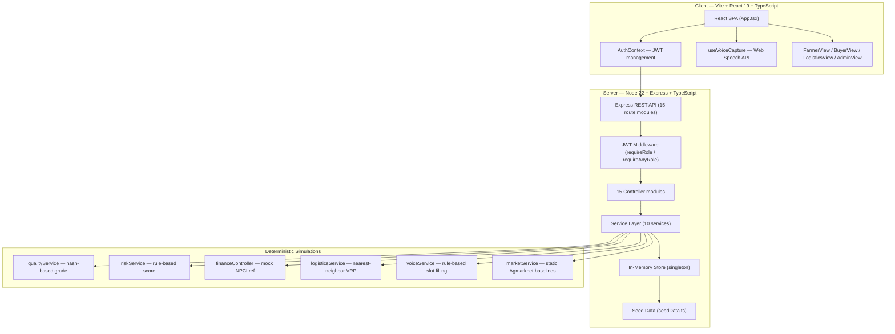
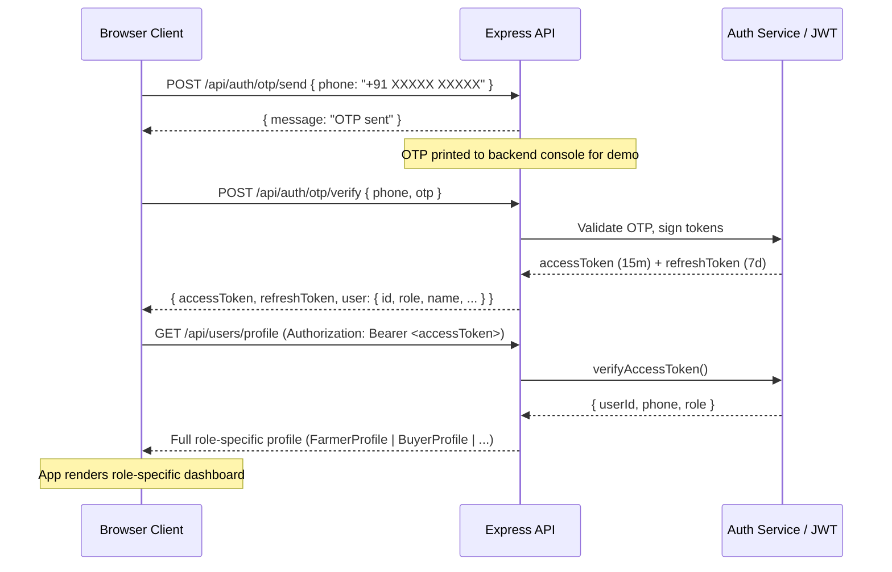
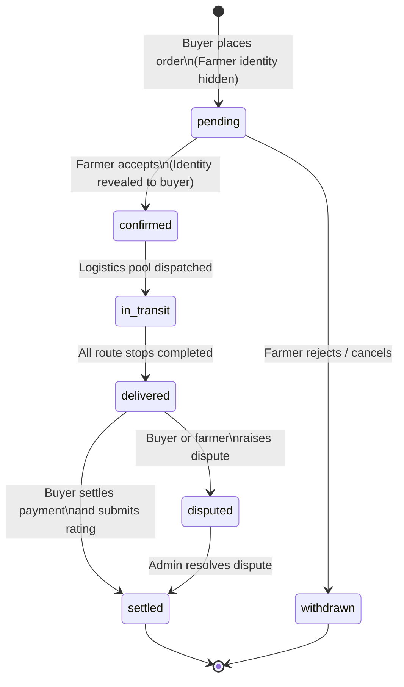

# Kisan Setu (वसुंधरा)

[](https://opensource.org/licenses/MIT)
[]()
[]()
[]()
[]()

**SIH 2026 — Problem Statement IHSIH009 | Team: Bumble Bee 404**

Kisan Setu is a direct farmgate-to-buyer digital commerce platform that removes agricultural intermediaries, protects farmer identities until the moment of confirmed sale, and connects smallholder farmers with processors, retailers, and bulk buyers across India.

The platform is designed for low-digital-literacy farmers and supports voice-first interaction in five regional languages (English, Hindi, Marathi, Telugu, Punjabi).

---

## Table of Contents

- [Problem and Solution](#problem-and-solution)
- [Core Capabilities](#core-capabilities)
- [User Roles](#user-roles)
- [Ecosystem Flow](#ecosystem-flow)
- [Architecture Overview](#architecture-overview)
- [Technical Stack](#technical-stack)
- [Implementation Reality](#implementation-reality)
- [API Reference](#api-reference)
- [Data Models](#data-models)
- [Authentication and Privacy Flow](#authentication-and-privacy-flow)
- [Order Lifecycle](#order-lifecycle)
- [Testing](#testing)
- [Setup and Deployment](#setup-and-deployment)
- [Demo Walkthrough](#demo-walkthrough)
- [Revenue Model](#revenue-model)
- [Limitations and Roadmap](#limitations-and-roadmap)
- [Team](#team)

---

## Problem and Solution

### The Structural Failure of Indian Agricultural Markets

Indian smallholder farmers — who collectively cultivate over 140 million holdings — are locked into a system structurally designed to extract value from them:

- **Price opacity**: Farmers have no access to real-time mandi data and are forced to accept whatever rate intermediaries offer at the farm gate.
- **Intermediary rent extraction**: A 3–5 layer chain of arhatiyas, commission agents, and transporters captures an estimated 22–34% of the consumer price as margin, none of which reaches the farmer.
- **No quality certification**: Produce is graded subjectively at the point of sale by the buyer, giving buyers full information asymmetry.
- **Identity-based exploitation**: Revealing identity to sell enables cartel pricing, social coercion, and repeat harassment.
- **Credit exclusion**: Without documented transaction history or collateral, farmers cannot access formal credit and are pushed into predatory informal lending.

### How Kisan Setu Addresses This

Kisan Setu intercepts the transaction at the farm gate and rebuilds each stage in the farmer's favour:

| Problem | Kisan Setu Response |
|---|---|
| No price data | AI price band with mandi benchmark comparison |
| Subjective quality grading | Automated image-based quality assessment (A/B/C grade with sub-scores) |
| Identity exposure | Anonymous listing via persistent `FARM-XXXXX` seller ID until confirmation |
| No logistics access | Geo-clustered pooled transport shared across multiple orders |
| No credit history | Deterministic risk model building credit profile from platform activity |
| No scheme awareness | Rule-based government scheme eligibility matching |
| No whistleblower protection | Anonymous safety reporting with admin moderation |

---

## Core Capabilities

### Marketplace and Commerce

| Capability | What It Does | How It Is Implemented |
|---|---|---|
| **Anonymous listings** | Farmer publishes produce under a persistent anonymous ID (`FARM-XXXXX`). Real name and phone are withheld from all public responses until identity reveal. | `listingController.ts` scrubs `farmerRealName` and `farmerPhone` from API responses. Reveal controlled by `order.identityRevealed` flag. |
| **AI price band** | Shows farmer the minimum, fair, and maximum expected price for their crop with a confidence score and benchmark mandi reference. | `marketService.ts`: Static Agmarknet baselines for 7 crops (Tomato, Onion, Potato, Green Chilli, Wheat, Soybean, Grapes). Falls back to regional district APMC values for unlisted crops. |
| **Quality assessment** | Assigns A/B/C grade with sub-scores for color uniformity, surface defects, and firmness based on uploaded image. | `qualityService.ts`: Deterministic hash-based grading using per-crop quality profiles that mirror MobileNetV2 transfer-learning output distributions. |
| **Voice listing creation** | Farmer speaks their listing ("2 quintal tomato, 18 rupees") and the system extracts crop, quantity, and price. | `voiceService.ts`: Rule-based slot filling on Web Speech API transcript. Understands English, Hindi, Marathi, Telugu, and Punjabi crop synonyms. |
| **Buyer matching** | Buyers see listings ranked by composite match score. | `matchingService.ts`: Scoring across distance (Haversine, 35pts), quality grade (25pts), price-to-AI-band ratio (25pts), and farmer reputation (15pts). |
| **Order lifecycle** | Full 6-state order management with role-enforced transitions. | `orderController.ts`: State machine with transition validation. Each transition triggers backend notification events. |

### Logistics

| Capability | What It Does | How It Is Implemented |
|---|---|---|
| **Order pooling** | Groups geographically proximate confirmed orders into a single logistics pool to reduce cost and carbon emissions. | `logisticsService.ts`: DBSCAN-like greedy clustering on order pickup coordinates within a configurable radius. |
| **Route optimization** | Sequences pickup and dropoff stops within a pool to minimize travel distance. | `logisticsService.ts`: Nearest-neighbor heuristic VRP (documented OR-Tools CP-SAT swap-in). |
| **Stop tracking** | Logistics provider marks each stop (pickup and dropoff) as completed individually. | `logisticsController.ts`: Per-stop PATCH updates propagate to pool and order status. |
| **Fuel and carbon metrics** | Calculates estimated fuel savings and carbon reduced by pooling vs. individual trips. | Deterministic calculation at pool creation: `fuelSavingsPercent`, `carbonReducedKg`. |

### Finance and Inclusion

| Capability | What It Does | How It Is Implemented |
|---|---|---|
| **Risk assessment** | Generates a transparent risk score (0–100) and a working-capital advance eligibility amount. | `riskService.ts`: Rule-based formula combining price volatility index, order fulfillment rate, average quality grade, reputation score, and land holding size. |
| **Advance request** | Farmer requests a working-capital advance against their risk profile. | `financeController.ts`: Creates an `AdvanceRequest` record. |
| **AEPS simulation** | Simulated Aadhaar-linked biometric cashout with a mock NPCI transaction reference. | `POST /api/finance/aeps/simulate-cashout`: Returns a deterministic mock NPCI ref and BC agent name. Labeled `SIMULATED` throughout the UI. |
| **Government scheme matching** | Matches farmer to eligible central and state government agricultural schemes. | `schemeService.ts`: Rule-based eligibility matching against 18 seeded schemes by state, crop type, and land acreage. |

### Trust and Safety

| Capability | What It Does | How It Is Implemented |
|---|---|---|
| **Anonymous safety reporting** | Farmers can report cartel behavior, harassment, broker exploitation, payment defaults, or transport disputes without revealing identity. | `reportController.ts`: `isAnonymous` flag strips `reporterUserId` and `reporterName` from admin-facing response when set. |
| **Admin moderation** | Admin reviews the safety queue and updates report status. | `GET /api/reports/admin` (admin-only). `PATCH /api/reports/admin/:id` accepts `status` and `resolutionNotes`. |
| **Notifications** | Farmers and buyers receive event-driven notifications for order confirmations, logistics status updates, and identity reveals. | `notificationService.ts`: Backend appends notification records on key state transitions. Frontend polls `GET /api/notifications` every 30 seconds. |
| **Reputation system** | Mutual reputation scoring after settled orders. Impacts future risk assessments and match scoring. | `reputationController.ts` + `reputationService.ts`: Score updates on fulfillment success/failure, buyer ratings, and dispute events. |

### Market Intelligence

| Capability | What It Does | How It Is Implemented |
|---|---|---|
| **Market insights dashboard** | Shows 7-day price history, trend direction, volatility index, and an AI-generated weekly summary per crop. | `insightService.ts`: Aggregates seeded historical `MarketPricePoint` data. AI summaries are deterministic rule-based text generation. |

---

## User Roles

The platform has four distinct roles, each with a dedicated view and strictly enforced API permissions.

### Farmer

The primary beneficiary role. Farmers interact via a tabbed dashboard.

| Tab | Functionality |
|---|---|
| **Dashboard** | Overview stats: active listings, pending orders, fulfillment rate, reputation score. |
| **My Listings** | Create new listings (text or voice), view existing listings with status, withdraw listings. |
| **Orders** | View incoming buyer orders, accept or reject, track delivery status. Identity reveal occurs upon confirmation. |
| **Schemes** | Browse and filter 18 matched government schemes with eligibility reasons and application links. |
| **Finance** | View risk assessment with transparent factor breakdown. Request working-capital advance. Run AEPS biometric cashout simulation. |
| **Safety** | Submit anonymous or identified reports. View submission confirmation. |
| **Market Insights** | Crop price trends, 7-day history, AI weekly summary, volatility indicators. |

### Buyer

Buyers are processors, retailers, or farmer-producer organizations.

| Tab | Functionality |
|---|---|
| **Marketplace** | Browse ranked active listings with match scores. Filter by crop, quality grade, price range. View quality sub-scores. |
| **Procurement** | Place orders against active listings. Configure quantity and delivery address. |
| **My Orders** | Track all orders by status. Settle delivered orders with star rating. |

### Logistics

Logistics providers see geo-clustered delivery pools.

| Tab | Functionality |
|---|---|
| **Available Pools** | View unassigned pools in their region. Join/claim a pool. |
| **Active Delivery** | View assigned pool with optimized stop sequence, pickup and dropoff details, contact information. Mark stops as completed individually. |
| **Pool Status** | Pool transitions from `assigned` → `in_transit` → `delivered` as stops complete. |

### Admin

Full-platform visibility and moderation controls.

| Tab | Functionality |
|---|---|
| **Overview** | Platform-wide statistics. |
| **Safety Queue** | Full safety report queue with status filter. Update report status with resolution notes. |
| **Reports** | Market and platform reporting data. |

---

## Ecosystem Flow


```mermaid
flowchart TD
    subgraph F ["Farmer"]
        F1["Voice or Text Listing"] --> F2["Quality Assessment"]
        F2 --> F3["AI Price Band"]
        F3 --> F4["Publish as FARM-XXXXX"]
    end

    subgraph B ["Buyer"]
        B1["Browse Ranked Marketplace"] --> B2["Place Order"]
        B2 --> B3["Settle and Rate"]
    end

    subgraph L ["Logistics"]
        L1["Geo-Cluster Confirmed Orders"] --> L2["Nearest-Neighbor Route"]
        L2 --> L3["Mark Stops Complete"]
    end

    subgraph A ["Admin / Trust"]
        A1["Safety Report Moderation"] --> A2["Reputation Score Update"]
    end

    F4 --> B1
    B2 --> |"Order pending — identity hidden"| F4
    F4 --> |"Farmer confirms — identity revealed"| B2
    B2 --> |"Confirmed order triggers pooling"| L1
    L3 --> |"Delivered"| B3
    B3 --> A2
    F --> |"Anonymous report"| A1
```

---

## Architecture Overview


```mermaid
graph TB
    subgraph "Client — Vite + React 19 + TypeScript"
        UI["React SPA (App.tsx)"]
        Auth["AuthContext — JWT management"]
        Voice["useVoiceCapture — Web Speech API"]
        Roles["FarmerView / BuyerView / LogisticsView / AdminView"]
        UI --> Auth
        UI --> Voice
        UI --> Roles
    end

    subgraph "Server — Node 22 + Express + TypeScript"
        API["Express REST API (15 route modules)"]
        AuthMiddleware["JWT Middleware (requireRole / requireAnyRole)"]
        Controllers["15 Controller modules"]
        Services["Service Layer (10 services)"]
        Store["In-Memory Store (singleton)"]
        SeedData["Seed Data (seedData.ts)"]
    end

    subgraph "Deterministic Simulations"
        QualitySim["qualityService — hash-based grade"]
        RiskSim["riskService — rule-based score"]
        AEPSSim["financeController — mock NPCI ref"]
        RouteSim["logisticsService — nearest-neighbor VRP"]
        VoiceSim["voiceService — rule-based slot filling"]
        MarketSim["marketService — static Agmarknet baselines"]
    end

    Auth --> API
    API --> AuthMiddleware
    AuthMiddleware --> Controllers
    Controllers --> Services
    Services --> Store
    Store --> SeedData
    Services --> QualitySim
    Services --> RiskSim
    Services --> AEPSSim
    Services --> RouteSim
    Services --> VoiceSim
    Services --> MarketSim
```

The server and client share a single type definition file (`shared/types.ts`) to guarantee type safety across the API boundary without a code-generation step.

---

## Technical Stack

| Layer | Technology | Notes |
|---|---|---|
| **Frontend runtime** | Vite 8.3 + React 19 | Single-page application |
| **Frontend language** | TypeScript 7.0 | Strict mode, `noEmit` typecheck in CI |
| **Frontend styling** | Tailwind CSS 4 via `@tailwindcss/vite` | Custom design system in `index.css` |
| **Frontend icons** | Lucide React 0.546 | No emoji icons |
| **Backend runtime** | Node.js 22, Express 4.21 | ESM modules throughout |
| **Backend language** | TypeScript 7.0 | Separate `tsconfig.server.json` |
| **Authentication** | `jsonwebtoken` 9.0 | JWT access (15m) + refresh (7d) |
| **Database** | In-memory singleton (`data/store.ts`) | No persistence; resets on server restart |
| **Test runner** | Vitest 5.0 + Supertest 7.2 | 330 tests across 12 files |
| **Dev server** | `tsx --watch` | Hot-reload for backend during development |

---

## Implementation Reality

Every "AI" component in this MVP is a **deterministic, transparent, testable fallback** with a documented production swap-in point. No external model serving endpoints are required to run the demo.

| Feature | Classification | Current Implementation | Production Replacement |
|---|---|---|---|
| **Quality assessment** | Deterministic fallback | `qualityService.ts`: per-crop quality profiles + stable image hash → A/B/C grade with realistic sub-scores. Mirrors MobileNetV2 output distribution without inference. | Real CNN inference via TF.js in-browser or Python microservice (same response contract). |
| **Risk model** | Deterministic fallback | `riskService.ts`: transparent multi-factor formula. Inputs: price volatility CV, fulfillment rate, avg quality grade, reputation score, land size. Output: 0–100 score + advance eligibility. | Retrain XGBoost on real repayment data; replace `assessRisk()` function. |
| **Logistics routing** | Deterministic fallback | `logisticsService.ts`: Haversine-based greedy geo-clustering + nearest-neighbor VRP stop sequencer. OR-Tools swap-in is documented in service header. | OR-Tools CP-SAT VRP solver via Python microservice. |
| **Voice processing** | Deterministic fallback | `voiceService.ts`: Web Speech API for STT/TTS (browser-native). Server-side slot filling by keyword matching across 5 languages. | Bhashini API for server-side multilingual STT + named-entity extraction. |
| **Market prices** | Static baseline | `marketService.ts`: Hardcoded Agmarknet baselines for 7 crops (Tomato, Onion, Potato, Green Chilli, Wheat, Soybean, Grapes). `trend` is static `'rising'`. | Scheduled Agmarknet CSV ingest + Prophet trend model. |
| **Market insights** | Deterministic fallback | `insightService.ts`: Seeded `MarketPricePoint[]` history; AI summaries are template-based rule-generated text. | LLM-generated summaries (Gemini API) over real price time-series. |
| **AEPS banking** | Simulated integration | `POST /api/finance/aeps/simulate-cashout`: Returns hardcoded mock NPCI transaction ref and BC agent details after a simulated delay. Clearly labeled `SIMULATED` in UI. | Licensed NPCI AEPS API via a registered BC agent partner. |

---

## API Reference

All endpoints are prefixed with `/api`. The server runs on port **4000** by default.

### Authentication

| Method | Endpoint | Auth Required | Description |
|---|---|---|---|
| `POST` | `/auth/otp/send` | None | Sends a 6-digit OTP to a `+91` phone number. OTP is printed to backend console in demo mode. |
| `POST` | `/auth/otp/verify` | None | Verifies OTP. Returns `{ accessToken, refreshToken, user }`. |
| `GET` | `/auth/me` | Bearer JWT | Returns the authenticated user's full profile. |
| `POST` | `/auth/refresh` | Refresh token in body | Issues a new access token from a valid refresh token. |

### Users

| Method | Endpoint | Auth Required | Description |
|---|---|---|---|
| `GET` | `/users/profile` | Any role | Returns the role-specific profile (FarmerProfile, BuyerProfile, etc.) for the current user. |

### Listings

| Method | Endpoint | Auth Required | Description |
|---|---|---|---|
| `GET` | `/listings` | None (public) | Returns all listings. Private fields (`farmerRealName`, `farmerPhone`) are stripped for non-admin callers. |
| `GET` | `/listings/:id` | None (public) | Returns a single listing. |
| `POST` | `/listings` | Farmer | Creates a new listing. Expects quality and price data from prior assessment calls. |
| `PATCH` | `/listings/:id/status` | Farmer, Admin | Updates listing status (e.g., `active` → `withdrawn`). |

### Matching

| Method | Endpoint | Auth Required | Description |
|---|---|---|---|
| `GET` | `/matching/buyer/:id` | Buyer, Admin | Returns all active listings ranked by composite `matchScore` for the given buyer. Each result includes `distanceKm` and `matchFactors`. |
| `GET` | `/matching/listing/:id` | Farmer, Admin | Returns ranked buyers for a specific listing. |

### Orders

| Method | Endpoint | Auth Required | Description |
|---|---|---|---|
| `GET` | `/orders` | Any role | Returns orders scoped to the caller's role (buyer sees own, farmer sees theirs, logistics sees confirmed pool candidates, admin sees all). |
| `POST` | `/orders` | Buyer, Admin | Creates a new order. Validates the listing is active and requested quantity is available. |
| `GET` | `/orders/:id` | Any role | Returns a single order. Private seller fields are stripped unless `identityRevealed = true`. |
| `PATCH` | `/orders/:id/status` | Farmer, Buyer, Logistics, Admin | Advances order status with role-specific transition rules. |

### Logistics

| Method | Endpoint | Auth Required | Description |
|---|---|---|---|
| `GET` | `/logistics/pools` | None (public) | Returns all logistics pools. |
| `POST` | `/logistics/pools` | Logistics, Admin | Creates a logistics pool manually. |
| `POST` | `/logistics/pools/auto` | Logistics, Admin | Auto-creates pools by geo-clustering confirmed orders within radius. |
| `GET` | `/logistics/pools/:id` | None (public) | Returns a single pool with all orders, stops, and route data. |
| `PATCH` | `/logistics/pools/:id` | Logistics, Admin | Updates pool status. |
| `GET` | `/logistics/pools/:id/route` | Logistics, Admin | Returns the optimized stop sequence for a pool. |
| `POST` | `/logistics/pools/:id/join` | Logistics, Admin | Logistics provider claims an unassigned pool. |
| `PATCH` | `/logistics/pools/:id/stops/:stopId` | Logistics, Admin | Marks a single route stop as completed. |

### Quality and Market

| Method | Endpoint | Auth Required | Description |
|---|---|---|---|
| `POST` | `/quality/assess` | Farmer | Accepts `{ imageData, crop }`. Returns `QualityAssessment` with grade, confidence, and sub-scores. |
| `GET` | `/market/price-band` | Any role | Accepts `crop` and `region` query params. Returns `PriceBand` (min/fair/max/confidence/trend/benchmarkMandi). |

### Finance

| Method | Endpoint | Auth Required | Description |
|---|---|---|---|
| `GET` | `/finance/risk/:farmerId` | Farmer, Admin | Returns the computed `RiskAssessment` for a farmer with score, tier, eligible advance, and factor breakdown. |
| `GET` | `/finance/advances` | Farmer, Admin | Returns all advance requests for the current farmer. |
| `POST` | `/finance/advances` | Farmer | Creates an advance request against the farmer's risk profile. |
| `POST` | `/finance/aeps/simulate-cashout` | Farmer | Runs the simulated AEPS biometric cashout. Returns mock NPCI ref and BC agent name. |

### Schemes, Reports, Notifications, Insights

| Method | Endpoint | Auth Required | Description |
|---|---|---|---|
| `GET` | `/schemes/match/:farmerId` | Farmer, Admin | Returns all matched government schemes with `eligibilityReason` and `relevanceScore`. |
| `POST` | `/reports` | Farmer | Submits a safety report (anonymous or identified). |
| `GET` | `/reports/admin` | Admin | Returns the full moderation queue. |
| `PATCH` | `/reports/admin/:id` | Admin | Updates a report's status and resolution notes. |
| `GET` | `/notifications` | Any role | Returns all notifications targeting the current user. |
| `PATCH` | `/notifications/:id/read` | Any role | Marks a notification as read. |
| `GET` | `/insights/dashboard` | Any role | Returns `{ insights: MarketInsight[], summary: string }` for the market intelligence dashboard. |
| `POST` | `/reputation/event` | Any role | Records a reputation event (buyer/farmer rating, fulfillment outcome). |
| `GET` | `/reputation/:userId` | Any role | Returns the reputation history for a user. |

### Utility

| Method | Endpoint | Auth Required | Description |
|---|---|---|---|
| `GET` | `/health` | None | Returns `{ status: 'ok', timestamp, service: 'Vasundhara API' }`. |
| `POST` | `/voice/extract` | Farmer | Accepts `{ transcript, language }`. Returns structured `VoiceExtractionResult`. |

---

## Data Models

All types are defined once in `shared/types.ts` and imported by both frontend and backend, eliminating API contract drift.

### Core Types

**`FarmerProfile`** — extends `UserProfile`
```ts
{
  anonSellerId: string;       // e.g. "FARM-88214" — permanent anonymous market identity
  village: string;
  district: string;
  state: string;
  lat: number;
  lng: number;
  landSizeAcres: number;
  primaryCrops: string[];
  reputationScore: number;    // 0.0 – 5.0
  totalOrdersFulfilled: number;
  disputeCount: number;
}
```

**`Listing`**
```ts
{
  id: string;
  anonSellerId: string;
  farmerRealName?: string;    // Stripped from public API; present only post identity-reveal
  farmerPhone?: string;       // Stripped from public API; present only post identity-reveal
  crop: string;
  variety: string;
  quantityKg: number;
  priceExpected: number;
  priceAi: PriceBand;         // { min, fair, max, confidence, trend, benchmarkMandi }
  quality: QualityAssessment; // { grade, confidence, colorUniformity, surfaceDefects, firmnessScore }
  status: 'active' | 'matched' | 'sold' | 'withdrawn';
  createdVia: 'voice' | 'text';
  lat: number;
  lng: number;
}
```

**`Order`**
```ts
{
  id: string;
  listingId: string;
  anonSellerId: string;
  sellerRealName?: string;    // Only populated once identityRevealed = true
  sellerPhone?: string;
  identityRevealed: boolean;
  identityRevealedAt?: string;
  status: OrderStatus;
  buyerRating?: number;
  farmerRating?: number;
}
```

**`OrderStatus`**
```ts
'pending' | 'matched' | 'confirmed' | 'in_transit' | 'delivered' | 'settled' | 'disputed'
```

**`RiskAssessment`**
```ts
{
  riskScore: number;          // 0–100 (lower = less risky)
  riskTier: 'Low Risk' | 'Moderate Risk' | 'High Risk';
  eligibleAdvanceAmount: number; // INR; 0 for High Risk
  factors: {
    priceVolatilityIndex: string;
    fulfillmentRate: string;
    avgQualityGrade: string;
    reputationScore: number;
    landHoldingWeight: string;
  };
  explanation: string;        // Human-readable audit trail
}
```

**`LogisticsPool`**
```ts
{
  id: string;
  clusterRegion: string;
  status: 'unassigned' | 'assigned' | 'in_transit' | 'delivered';
  orders: Order[];
  routeStops: RouteStop[];    // Sequenced by nearest-neighbor algorithm
  totalWeightKg: number;
  fuelSavingsPercent: number;
  carbonReducedKg: number;
}
```

**`SafetyReport`**
```ts
{
  isAnonymous: boolean;
  reporterUserId?: string;    // Omitted if anonymous
  category: 'Underpricing & Cartel' | 'Harassment' | 'Broker Exploitation'
            | 'Payment Default' | 'Transport Dispute';
  status: 'open' | 'reviewing' | 'resolved';
  resolutionNotes?: string;   // Added by admin
}
```

---

## Authentication and Privacy Flow

### Authentication Sequence


```mermaid
sequenceDiagram
    participant Client as Browser Client
    participant API as Express API
    participant Auth as Auth Service / JWT

    Client->>API: POST /api/auth/otp/send { phone: "+91 XXXXX XXXXX" }
    API-->>Client: { message: "OTP sent" }
    Note over API: OTP printed to backend console for demo

    Client->>API: POST /api/auth/otp/verify { phone, otp }
    API->>Auth: Validate OTP, sign tokens
    Auth-->>API: accessToken (15m) + refreshToken (7d)
    API-->>Client: { accessToken, refreshToken, user: { id, role, name, ... } }

    Client->>API: GET /api/users/profile (Authorization: Bearer <accessToken>)
    API->>Auth: verifyAccessToken()
    Auth-->>API: { userId, phone, role }
    API-->>Client: Full role-specific profile (FarmerProfile | BuyerProfile | ...)
    Note over Client: App renders role-specific dashboard
```

### Role-Based Access Control

Two middleware functions enforce permissions at the route level:
- `requireRole(...roles)` — strict exact match on one role.
- `requireAnyRole(...roles)` — accepts any of the provided roles.

Neither function uses a session or cookie; authorization is stateless via JWT claims embedded in the `Authorization: Bearer` header.

### Anonymous Identity Flow

Farmer identity protection is implemented at two layers:

1. **Listing API layer**: `listingController.ts` deletes `farmerRealName` and `farmerPhone` from all listing responses unless the caller is an admin.
2. **Order identity reveal**: The `Order` object holds `sellerRealName`, `sellerPhone`, `sellerVillage`, `sellerDistrict`, and `sellerState` as optional fields. These are populated only when `order.identityRevealed = true`, which is set by `orderController.ts` when a farmer transitions an order from `pending` to `confirmed`. The reveal is permanent and timestamped (`identityRevealedAt`).

---

## Order Lifecycle


```mermaid
stateDiagram-v2
    [*] --> pending : Buyer places order\n(Farmer identity hidden)
    pending --> confirmed : Farmer accepts\n(Identity revealed to buyer)
    pending --> withdrawn : Farmer rejects / cancels
    confirmed --> in_transit : Logistics pool dispatched
    in_transit --> delivered : All route stops completed
    delivered --> settled : Buyer settles payment\nand submits rating
    delivered --> disputed : Buyer or farmer\nraises dispute
    disputed --> settled : Admin resolves dispute
    settled --> [*]
    withdrawn --> [*]
```

**State transition rules** (enforced in `orderController.ts`):

| From | To | Allowed Roles | Side Effects |
|---|---|---|---|
| `pending` | `confirmed` | Farmer | Sets `identityRevealed = true`, `identityRevealedAt`. Fires `reveal` notification. |
| `pending` | `withdrawn` | Farmer | Fires cancellation notification. |
| `confirmed` | `in_transit` | Logistics, Admin | Linked pool status moves to `in_transit`. |
| `in_transit` | `delivered` | Logistics, Admin | Fires delivery notification to buyer and farmer. |
| `delivered` | `settled` | Buyer | Stores `buyerRating`, triggers reputation scoring event. |
| `delivered` | `disputed` | Buyer, Farmer | Creates safety report record. |
| `disputed` | `settled` | Admin | Admin provides resolution notes. |

---

## Testing

The backend test suite uses **Vitest 5.0** and **Supertest 7.2**. All 12 test files run against a fresh in-memory store initialized with seed data per file.

**Current result: 330 tests across 12 files, all passing.**

```
Test Files  12 passed (12)
     Tests  330 passed (330)
  Duration  ~960ms
```

| Test File | Coverage Area |
|---|---|
| `api.test.ts` | Full API surface: auth, listings, orders, logistics, finance, schemes, notifications, reports |
| `auth-flow.test.ts` | OTP send/verify, JWT expiry, role guard enforcement |
| `demo-flow.test.ts` | End-to-end demo sequence validation |
| `edge-case-audit.test.ts` | Invalid inputs, boundary conditions, error paths |
| `finance.test.ts` | Risk scoring logic, advance requests, AEPS simulation |
| `insights.test.ts` | Market intelligence, price band, insight aggregation |
| `marketplace-flow.test.ts` | Listing creation → buyer matching → order placement |
| `matching.test.ts` | Match score calculation, distance ranking, factor breakdown |
| `reports.test.ts` | Anonymous reporting, admin moderation queue, status transitions |
| `role-boundaries.test.ts` | Role-based access enforcement across all protected endpoints |
| `schemes.test.ts` | Scheme eligibility matching across state/crop/acreage rules |
| `state-consistency.test.ts` | Order state machine transition validity |

```bash
# Run full test suite
npm test

# Frontend typecheck
npm run lint

# Backend typecheck
npm run lint:server

# Production build
npm run build
```

---

## Setup and Deployment

### Prerequisites

- Node.js 22 or later
- npm 10 or later

### Installation

```bash
# Clone and install all dependencies
git clone <repo>
cd SIH2026_MVP
npm install
```

### Environment Variables

Create a `.env` file in the project root (copy `.env.example`):

```env
# Backend (Express — port 4000)
PORT=4000
JWT_SECRET=vasundhara-dev-secret-change-in-production
JWT_REFRESH_SECRET=vasundhara-refresh-secret-change-in-production
FRONTEND_URL=http://localhost:3000

# Frontend (Vite)
VITE_API_BASE_URL=http://localhost:4000/api
```

### Running Locally

```bash
# Terminal 1: Start backend API server (port 4000, hot-reload)
npm run dev:server

# Terminal 2: Start frontend dev server (port 3000, hot-reload)
npm run dev
```

Frontend: `http://localhost:3000`  
Backend health: `http://localhost:4000/api/health`

OTPs are printed to the backend console in the format:
```
[OTP] Phone: +91 98231 44521 | OTP: 292450 | Expires: 2026-09-27T...
```

### Production Build

```bash
npm run build
```

Outputs to `dist/`. The backend is started with:
```bash
npm run start:server
```

---

## Demo Walkthrough

This 6-minute sequence demonstrates the complete platform flow across all four roles. Demo accounts use real seed data pre-loaded at server start.

### Demo Accounts

| Role | Phone | Name | Seed ID | Details |
|---|---|---|---|---|
| **Farmer** | `+91 98231 44521` | Ramesh Patil | `farmer_1` | FARM-88214, Pimpalgaon, Nashik, Maharashtra. 3.5 acres. Tomato, Onion, Grapes. Reputation 4.9/5. |
| **Farmer 2** | `+91 94481 22910` | Lakshmi Devi | `farmer_2` | FARM-34902, Mulbagal, Kolar, Karnataka. 2.2 acres. Tomato, Green Chilli, Potato. |
| **Buyer** | `+91 99801 88301` | Vikram Joshi | `buyer_1` | Processor, Sahyadri Agro Processing Ltd., Pune. |
| **Logistics** | `+91 98224 55198` | Kailash Shinde | `logistics_1` | Bolero Pickup 1.5T, Nashik, 180km radius. |
| **Admin** | `+91 99999 99999` | Admin User | `admin_1` | Full platform access. |

OTPs print to the backend console; any phone number in the seed data will work.

### Step-by-Step Demo

| Time | Role | Action | Expected Result |
|---|---|---|---|
| 0:00 | — | Open `http://localhost:3000` | OTP login screen with animated background. |
| 0:15 | Farmer | Enter `+91 98231 44521` → Send OTP → Enter OTP from console | Authenticated into Farmer dashboard. |
| 0:30 | Farmer | Click "Create Listing" → click mic icon → say "2 quintal tomato, 18 rupees" | Voice transcript extracted: Tomato, 200kg, ₹18. |
| 1:00 | Farmer | Upload any photo → click "Assess Quality" | Returns Grade A (~96%), ₹16–21 price band (Pimpalgaon APMC). |
| 1:30 | Farmer | Click "Publish Listing" | Listing appears in My Listings as `FARM-88214`. |
| 2:00 | — | Switch role → Buyer (`+91 99801 88301`) | Authenticated into Buyer Marketplace. |
| 2:15 | Buyer | View Marketplace | Tomato listing from `FARM-88214` appears at top (98+ match score). |
| 2:30 | Buyer | Click listing → "Place Order" → 1000kg @ ₹18/kg | Order created: `status: pending`. Farmer identity hidden. |
| 3:00 | — | Switch role → Farmer | Farmer's Orders tab shows incoming pending order. |
| 3:15 | Farmer | Accept the order | Order: `status: confirmed`. Buyer's name/phone revealed to farmer. Farmer's real name/phone revealed to buyer. |
| 3:30 | — | Switch role → Logistics (`+91 98224 55198`) | Pool `POOL-NSK-01` visible with confirmed orders. |
| 3:45 | Logistics | Open pool → mark pickup stops → mark dropoff stops | Pool transitions: `assigned` → `in_transit` → `delivered`. |
| 4:00 | — | Switch role → Farmer | Finance tab: Risk Low, Eligible ₹40,000–₹50,000 advance. |
| 4:20 | Farmer | Click "Request Advance" → open AEPS modal → enter Aadhaar last 4 digits | AEPS biometric animation → mock NPCI ref returned. Labeled `SIMULATED`. |
| 4:45 | — | Switch role → Buyer | ORD-1092 shows `delivered`. |
| 5:00 | Buyer | Click "Settle" → rate 5 stars | Order: `status: settled`. Reputation event recorded. |
| 5:15 | — | Switch role → Farmer | Schemes tab: browse 18 matched government schemes with eligibility reasons. |
| 5:30 | Farmer | Safety tab → "Report Issue" → select "Underpricing & Cartel" → submit anonymously | Report submitted; `isAnonymous: true`. |
| 5:45 | — | Switch role → Admin | Reports tab shows safety queue including the new report. |
| 6:00 | Admin | Open report → set status "Reviewing" → add resolution notes | Report status updated. |

---

## Revenue Model

> The following revenue streams represent the proposed commercialization model for production deployment. The current MVP does not charge users or implement any monetization mechanism.

| Stream | Mechanism |
|---|---|
| **Transaction service fee** | A percentage fee on the gross transaction value for each successfully settled order. |
| **Logistics platform fee** | Revenue from pooled logistics operations facilitated through the platform, charged to buyers or logistics providers. |
| **Buyer / enterprise subscriptions** | Monthly subscriptions for processors and large buyers granting access to advanced sourcing analytics, procurement workflows, and market intelligence. |
| **Financial services referral** | Referral revenue from regulated financial institutions (NBFCs, cooperative banks) for working-capital products issued through the risk-assessed farmer base. |
| **Premium market intelligence** | Paid tier for export-oriented buyers and commodity traders requiring real-time price forecasting, crop arrival predictions, and regional demand analytics. |

---

## Limitations and Roadmap

### Current MVP Limitations

| Area | Limitation |
|---|---|
| **Data persistence** | In-memory store only. All data resets on server restart. No database layer. |
| **Price data** | Static Agmarknet baselines for 7 crops. Not live, not updated, `trend` is always `'rising'`. |
| **Market insights** | Seeded historical data only. AI summaries are templated text, not model-generated. |
| **Notifications** | 30-second HTTP polling. No WebSockets. No push notifications. |
| **Voice accuracy** | Keyword-based slot filling. Fails on heavily accented or grammatically varied speech. |
| **Image quality** | Image is accepted but quality grade is determined by a hash of the image data, not actual visual content analysis. |
| **Logistics geography** | Buyer dropoff coordinates are hardcoded to Pune in the MVP. |
| **AEPS** | Simulated flow only. No licensed NPCI/BC-agent integration. |
| **Multi-tenancy** | No real phone OTP delivery. OTPs are console-logged for demo purposes. |
| **Security** | No API rate limiting, no request logging, no WAF. |

### Production Roadmap

| Area | Required Work |
|---|---|
| **Database** | Prisma ORM + PostgreSQL (Supabase/Neon). Seed data → migrations. |
| **Real-time** | Replace 30s polling with Socket.IO or Server-Sent Events. |
| **OTP delivery** | Integrate Twilio / MSG91 / Kaleyra for actual SMS OTP. |
| **Quality AI** | Deploy MobileNetV2 model via TF.js or Python FastAPI microservice. |
| **Price feeds** | Scheduled ingest of Agmarknet CSVs + trend model (Prophet or ARIMA). |
| **Voice** | Bhashini API integration for server-side multilingual STT. |
| **AEPS** | Licensed NPCI API + BC agent partner onboarding. |
| **Logistics** | OR-Tools CP-SAT VRP solver via Python microservice. |
| **Security** | Rate limiting (express-rate-limit), Sentry error tracking, API gateway, E2E encryption for identity fields. |
| **PWA** | Service worker, cache-first strategy, background sync for offline-capable field usage. |
| **Deployment** | Vercel (frontend) + Railway or Render (backend) + Supabase (database) + GitHub Actions CI/CD. |

---

## Team

| Field | Value |
|---|---|
| **Problem Statement** | IHSIH009 — Direct Farmer-to-Buyer Digital Marketplace |
| **Team Name** | Bumble Bee 404 |
| **SIH Edition** | SIH 2026 |
| **Repository** | Private GitHub (monorepo) |

---

## License


MIT License — See `LICENSE` for details.

