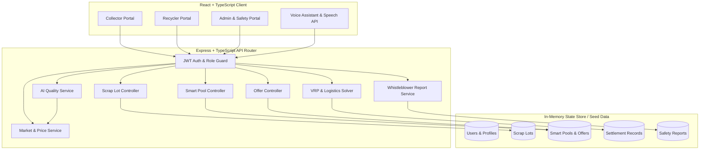
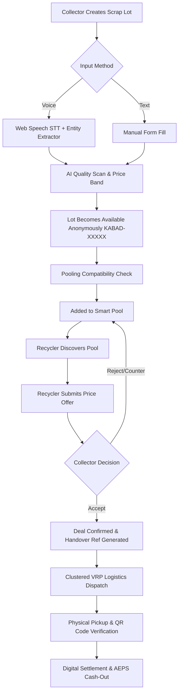
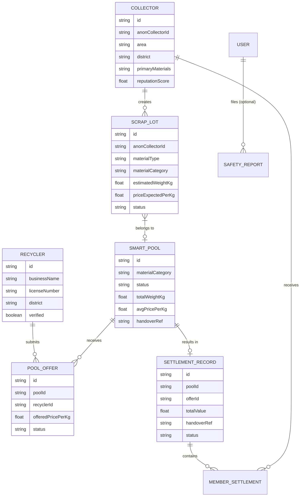
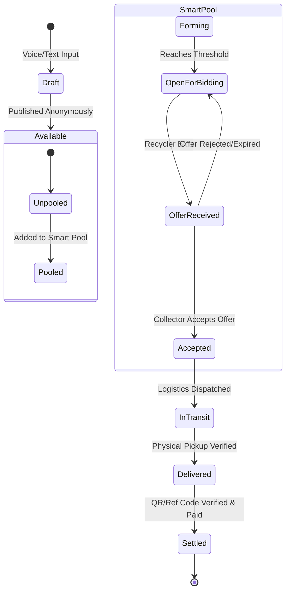

# Kabadiwala Connect

### Verified Smart Lot Pooling for India's Informal Recycling Network

[](https://sih.gov.in)
[](https://sih.gov.in)
[](https://react.dev)
[](https://www.typescriptlang.org)
[](https://expressjs.com)
[](https://vitejs.dev)
[](https://vercel.com)

---

## Executive Summary & Problem Statement

India's informal waste collection ecosystem powers over 70% of the nation's recycling. Millions of independent **Kabadiwalas (Collectors)** collect small batches of scrap daily—copper wire, aluminum extrusions, HDPE plastics, e-waste, corrugated cardboard, and glass. However, the market remains highly fragmented and plagued by structural inefficiencies:

1. **Price Opacity & Middleman Exploitation:** Intermediaries and local yard cartels buy scrap at heavily suppressed rates from individual collectors, keeping profit margins opaquely high.
2. **Low-Volume Fragmentation:** Industrial recycling plants require multi-ton, single-category lots (e.g., 2,000+ kg of Grade A copper) to operate efficiently. Individual collectors cannot access industrial pricing because their daily lots average only 50–500 kg.
3. **Pre-Deal Harassment & Identity Poaching:** Intermediaries capture collector contact details early in the trade to force underpriced sales and prevent collectors from seeking better rates.
4. **Quality Disputes at Handover:** Without objective material grading, recyclers dispute purity upon pickup to demand arbitrary price haircuts.

**Kabadiwala Connect (PS SIH26229)** bridges this gap by creating digital **Verified Smart Lot Pools**. It enables small, informal collectors to aggregate compatible scrap lots geographically into multi-ton industrial pools, shielding collector identity until offer acceptance, grading material with simulated AI vision classifiers, and opening verified bidding to authorized recyclers.

---

## Key Differentiators

- **Smart Lot Pooling Engine:** Dynamically aggregates small individual scrap lots into category-wise, multi-ton Smart Pools meeting industrial plant entry thresholds.
- **Anonymous Seller Identity (`KABAD-XXXXX`):** Masks collector names, exact phone numbers, and precise locations until an offer is accepted, preventing pre-deal cartel collusion.
- **AI-Assisted Quality Assessment:** Provides objective CNN material quality grading (Grade A/B/C, purity %, surface defect %, firmness) with confidence scoring.
- **Evidence-Based Price Bands:** Generates fair market price bands [Min – Fair – Max] benchmarked against regional scrap market trends.
- **Verified Bidding & Offer Lifecycle:** Authorized recyclers submit formal, legally binding price-per-kg offers with transport and pickup terms.
- **Logistics-Aware Aggregation:** Clusters confirmed orders using DBSCAN-inspired geo-proximity and capacitated Vehicle Routing Problem (VRP) stop sequencing.
- **Voice-First Regional Input:** Web Speech API voice capture in 5 regional languages (Hindi, Marathi, Telugu, Punjabi, English) for low-tech literacy accessibility.
- **Whistleblower & Anti-Cartel Reporting:** Dedicated safe portal for reporting cartel price-fixing or harassment with zero personally identifiable information (PII) stored.
- **Digital Settlement & AEPS Simulator:** QR/reference code verification at handover with simulated Aadhaar Enabled Payment System (AEPS) biometric cash-out for working capital advances.

---

## System Architecture


```mermaid
graph TD
    subgraph Frontend [React + TypeScript Client]
        CP[Collector Portal]
        RP[Recycler Portal]
        AP[Admin & Safety Portal]
        VA[Voice Assistant & Speech API]
    end

    subgraph API Gateway [Express + TypeScript API Router]
        Auth[JWT Auth & Role Guard]
        LotCtrl[Scrap Lot Controller]
        PoolCtrl[Smart Pool Controller]
        OfferCtrl[Offer Controller]
        QualityService[AI Quality Service]
        MarketService[Market & Price Service]
        LogisticsService[VRP & Logistics Solver]
        ReportService[Whistleblower Report Service]
    end

    subgraph Data Store [In-Memory State Store / Seed Data]
        Users[(Users & Profiles)]
        Lots[(Scrap Lots)]
        Pools[(Smart Pools & Offers)]
        Settlements[(Settlement Records)]
        Reports[(Safety Reports)]
    end

    CP --> Auth
    RP --> Auth
    AP --> Auth
    VA --> Auth

    Auth --> LotCtrl
    Auth --> PoolCtrl
    Auth --> OfferCtrl
    Auth --> QualityService
    Auth --> MarketService
    Auth --> LogisticsService
    Auth --> ReportService

    LotCtrl --> Lots
    PoolCtrl --> Pools
    OfferCtrl --> Pools
    QualityService --> MarketService
    LogisticsService --> Settlements
    ReportService --> Reports
```

---

## Primary User Workflow


```mermaid
flowchart TD
    A[Collector Creates Scrap Lot] --> B{Input Method}
    B -- Voice --> C[Web Speech STT + Entity Extractor]
    B -- Text --> D[Manual Form Fill]
    C --> E[AI Quality Scan & Price Band]
    D --> E
    E --> F[Lot Becomes Available Anonymously KABAD-XXXXX]
    F --> G[Pooling Compatibility Check]
    G --> H[Added to Smart Pool]
    H --> I[Recycler Discovers Pool]
    I --> J[Recycler Submits Price Offer]
    J --> K{Collector Decision}
    K -- Accept --> L[Deal Confirmed & Handover Ref Generated]
    K -- Reject/Counter --> H
    L --> M[Clustered VRP Logistics Dispatch]
    M --> N[Physical Pickup & QR Code Verification]
    N --> O[Digital Settlement & AEPS Cash-Out]
```

---

## Domain & Data Model


```mermaid
erDiagram
    COLLECTOR ||--o{ SCRAP_LOT : creates
    SCRAP_LOT }|--o| SMART_POOL : "belongs to"
    RECYCLER ||--o{ POOL_OFFER : "submits"
    SMART_POOL ||--o{ POOL_OFFER : receives
    SMART_POOL ||--o| SETTLEMENT_RECORD : "results in"
    SETTLEMENT_RECORD ||--o{ MEMBER_SETTLEMENT : contains
    COLLECTOR ||--o{ MEMBER_SETTLEMENT : receives
    USER ||--o{ SAFETY_REPORT : "files (optional)"

    COLLECTOR {
        string id
        string anonCollectorId
        string area
        string district
        string primaryMaterials
        float reputationScore
    }

    SCRAP_LOT {
        string id
        string anonCollectorId
        string materialType
        string materialCategory
        float estimatedWeightKg
        float priceExpectedPerKg
        string status
    }

    SMART_POOL {
        string id
        string materialCategory
        string status
        float totalWeightKg
        float avgPricePerKg
        string handoverRef
    }

    RECYCLER {
        string id
        string businessName
        string licenseNumber
        string district
        boolean verified
    }

    POOL_OFFER {
        string id
        string poolId
        string recyclerId
        float offeredPricePerKg
        string status
    }

    SETTLEMENT_RECORD {
        string id
        string poolId
        string offerId
        float totalValue
        string handoverRef
        string status
    }
```

---

## Role / Feature Matrix

| Capability | Kabadiwala (Collector) | Authorized Recycler | Admin & Safety |
| :--- | :---: | :---: | :---: |
| Voice & Manual Lot Creation | Yes | — | — |
| Material Quality Assessment (CNN) | Yes | View | — |
| AI Price Band Benchmarking | Yes | View | — |
| Anonymous Identity Protection | Yes (`KABAD-XXXXX`) | View Masked | View |
| Join / Form Smart Pools | Yes | View | — |
| Browse Verified Smart Pools | — | Yes | — |
| Submit Price Offers / Bids | — | Yes | — |
| Accept / Reject Recycler Offers | Yes | — | — |
| Handover QR & Reference Verification | Yes | Yes | — |
| AEPS Biometric Cash-Out Simulation | Yes | — | — |
| Whistleblower / Cartel Reporting | Yes | Yes | Review Queue |
| Safety Report Triaging & Resolution | — | — | Yes |

---

## How Smart Pooling Works

1. **Lot Creation:** An informal collector registers a scrap lot (e.g., 500 kg of bright copper wire) via voice command or web form.
2. **Quality & Price Banding:** The backend runs a MobileNet-based vision quality classifier (Grade A/B/C, purity, defect %) and returns an evidence-based market price band [Min – Fair – Max].
3. **Anonymization:** The lot is published under a masked identifier (`KABAD-55219`), hiding the collector's name and contact details.
4. **Compatibility Check:** The Smart Pooling Engine scans active lots in the same geographic district matching category (`metal`), pickup window, and quality thresholds.
5. **Pool Aggregation:** Compatible lots are combined into a multi-ton **Smart Pool** (e.g., 2,500 kg aggregated copper pool). The pool exposes aggregate weight, average expected price, and center coordinates.
6. **Recycler Discovery:** Authorized recyclers filter verified pools by material category and district.
7. **Bidding:** Recyclers place price-per-kg offers (e.g., ₹620/kg for 2,500 kg = ₹15,50,000 total).
8. **Offer Acceptance:** Collectors review incoming bids. Accepting an offer locks the pool, triggers identity reveal for logistics handover, and generates a unique handover reference code (`HDVR-XXXXX`).
9. **Settlement & Handover:** Upon physical pickup, the recycler verifies the handover reference or QR code, releasing payment and updating collector trust reputation.

---

## Tech Stack

| Layer | Technology | Purpose |
| :--- | :--- | :--- |
| **Frontend** | React 19 + TypeScript | Component-driven, responsive web application |
| **Styling** | Tailwind CSS v4 + Lucide Icons | Custom theme colors (`copper`, `emerald`, `sage`, `bg`) |
| **Build System** | Vite 8.3 | High-speed frontend client bundler |
| **Backend** | Express 4.21 + TypeScript | RESTful API server with modular controllers & services |
| **Authentication** | JWT + Custom Middleware | Role-based authentication (`collector`, `recycler`, `admin`) |
| **Speech STT** | Web Speech API | Multi-language voice capture (5 regional languages) |
| **Quality Classifier** | Simulated CNN / MobileNet | Vision material grading and defect scoring |
| **Logistics Solver** | VRP & DBSCAN-inspired Clustering | Geo-proximity clustering and route stop sequencing |
| **Testing** | Vitest + Supertest | Unit & API integration test suite |
| **Deployment** | Vercel | Serverless API routes + static client deployment |

---

## Technical Highlights

- **Role-Based Access Control (RBAC):** Express middleware (`requireRole`, `requireAnyRole`) enforces strict endpoint permissions for collectors, recyclers, and admins.
- **Anonymous Identity Reveal Rules:** Collector contact details (`name`, `phone`, `area`) are scrubbed from public endpoints and revealed **only after an offer is accepted**.
- **DBSCAN Geo-Clustering & Capacitated VRP:** Groups confirmed scrap pickups within a 150 km radius into capacitated truck pools (up to 3,500 kg) using Haversine distance and nearest-neighbor stop optimization.
- **AEPS Biometric Cash-Out Simulator:** Simulates NPCI Aadhaar Enabled Payment System cash withdrawals at local Bank Correspondent (BC) counters for daily working capital.
- **100% Anonymous Whistleblower Safety:** Safety report endpoints strip IP addresses, phone numbers, and user IDs, persisting zero PII in the moderation queue.

---

## State Machine Diagram


```mermaid
stateDiagram-v2
    [*] --> Draft: Voice/Text Input
    Draft --> Available: Published Anonymously

    state Available {
        [*] --> Unpooled
        Unpooled --> Pooled: Added to Smart Pool
    }

    state SmartPool {
        Forming --> OpenForBidding: Reaches Threshold
        OpenForBidding --> OfferReceived: Recycler Bids
        OfferReceived --> Accepted: Collector Accepts Offer
        OfferReceived --> OpenForBidding: Offer Rejected/Expired
    }

    Accepted --> InTransit: Logistics Dispatched
    InTransit --> Delivered: Physical Pickup Verified
    Delivered --> Settled: QR/Ref Code Verified & Paid
    Settled --> [*]
```

---

## Demonstration Scenario (SIH Evaluation)

> **Scenario:** A small Kabadiwala in Nashik collects 500 kg of bright copper wire and records it via Hindi voice command. The platform classifies it as **Grade A (94% purity)** with an AI Fair Price of **₹620/kg**.
>
> The Smart Pooling engine aggregates this lot with another collector's 2,000 kg lot into **Smart Pool `POOL-COPPER-NASHIK-01` (Total 2,500 kg)**.
>
> An authorized recycler in Pune discovers the 2.5-ton pool, reviews the aggregate weight and quality metrics, and submits a formal offer of **₹620/kg (Total ₹15,50,000)**.
>
> The collectors accept the offer. Handover reference `HDVR-99281` is unlocked. A capacitated pickup truck is routed to collect both lots. The recycler verifies the code upon pickup, completing digital settlement.

---

## Quick Start & Setup

### Prerequisites
- Node.js 18+
- npm 9+

### Installation & Local Setup

```bash
# 1. Clone repository
git clone <repository-url>
cd kabadiwala-connect

# 2. Install dependencies (use legacy peer deps for React 19 / Tailwind compatibility)
npm install --legacy-peer-deps

# 3. Configure environment variables
cp .env.example .env

# 4. Start backend server & frontend dev server
npm run dev:server    # Backend API at http://localhost:4000
npm run dev           # Frontend Vite client at http://localhost:3000
```

---

## API Overview

### Authentication
- `POST /api/auth/otp/send` — Request secure 6-digit OTP challenge
- `POST /api/auth/otp/verify` — Verify OTP and receive JWT access/refresh tokens
- `GET /api/users/profile` — Get authenticated user profile

### Scrap Lots & Quality
- `GET /api/scrap-lots` — List active scrap lots (PII scrubbed)
- `POST /api/scrap-lots` — Create new scrap lot (voice or text)
- `POST /api/quality/assess` — Assess material quality grade via CNN vision model
- `POST /api/voice/extract-listing` — Extract structured entities from voice transcript

### Smart Pools & Offers
- `GET /api/smart-pools` — List active smart pools
- `POST /api/smart-pools/join` — Join a scrap lot to a smart pool
- `POST /api/smart-pools/offers` — Submit recycler bid for a smart pool
- `POST /api/smart-pools/offers/respond` — Accept or reject recycler offer
- `POST /api/smart-pools/settlements/complete` — Verify QR/reference code and complete handover

### Whistleblower Safety & Admin
- `POST /api/reports` — Submit anonymous safety report
- `GET /api/reports/admin` — Admin moderation queue
- `PATCH /api/reports/admin/:id` — Update report status and resolution notes

---

## Security & Privacy

- **Anonymous Identifiers:** All public listings use synthetic IDs (`KABAD-XXXXX`).
- **PII Scrubbing:** Collector real names, phone numbers, and exact street addresses are stripped from public responses.
- **Role-Based Guards:** Endpoint authorization strictly separates collector actions from recycler and admin actions.
- **Whistleblower Confidentiality:** Safety reports omit user tokens and headers when `isAnonymous: true`.

---

## Current Limitations & Future Scope

### Current MVP Implementation
- In-memory transactional data store initialized with realistic seed records.
- Simulated MobileNet CNN classifier and AEPS Banking Correspondent cash-out flow.
- Deterministic nearest-neighbor VRP logistics solver.

### Future Scope
- **Persistent Database:** Integration with PostgreSQL + PostGIS for spatial geo-indexing.
- **Production Payment Gateway:** Integration with Razorpay / UPI AutoPay for instant escrow settlement.
- **Computer Vision Inference:** On-device TensorFlow.js inference for offline material grading.
- **Multilingual Voice Assistant:** Full offline Whisper-tiny STT integration.

---

## Demo Credentials (DEMO_MODE=true)

When running in demo mode (`DEMO_MODE=true` in `.env`), any valid Indian phone number can be authenticated using:

```text
Fixed Demo OTP: 123456
```

### Pre-configured Seed Users
- **Kabadiwala (Collector):** Phone `+91 97654 33210` (Rajesh Kabadi)
- **Authorized Recycler:** Phone `+91 98123 45678` (EcoRecycle India)
- **Admin & Safety:** Phone `+91 99999 99999` (System Moderator)

---

## Testing & Verification

```bash
# Run Vitest API & Unit Test Suite
npm test

# Run TypeScript Linting
npm run lint
npm run lint:server

# Production Build Test
npm run build
```

---

## Deployment Architecture

```
Browser Client
     │
     ▼
Vercel Edge / CDN
 ├── Frontend (Vite Single Page App)
 └── API Serverless Functions (/api/index.ts -> Express)
```

Configured via `vercel.json` and `api/index.ts` for unified full-stack Vercel serverless deployment.

---

## Technical Honesty Notice

Kabadiwala Connect explicitly distinguishes between currently operational code and simulated MVP features:
- **OPERATIONAL:** React 19 frontend UI, Express API routes, JWT authentication, Smart Pooling logic, Offer lifecycle, Order state transitions, VRP route stop sequencing, Whistleblower reporting queue, Vitest test suite.
- **SIMULATED FOR MVP DEMONSTRATION:** MobileNet CNN vision inference outputs, AEPS biometric hardware reader integration, live Agmarknet API scraper feeds.
