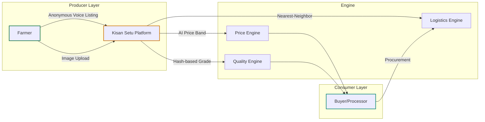
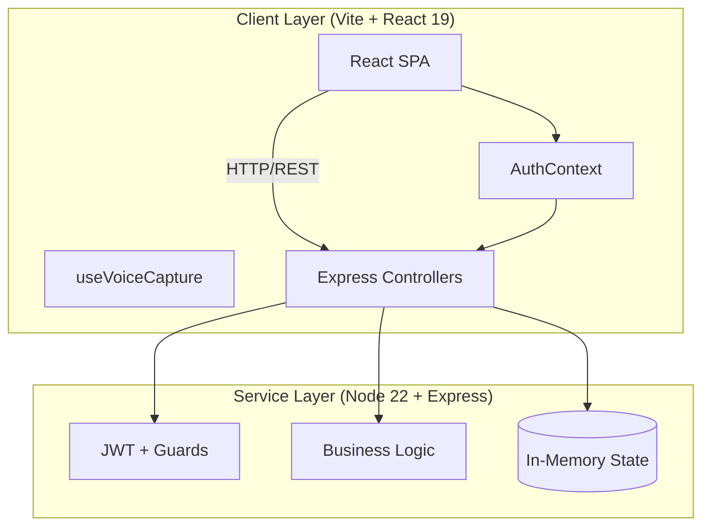

# Kisan Setu (वसुंधरा)

[](https://opensource.org/licenses/MIT)
[]()
[]()
[]()
[]()

**SIH 2026 — Problem Statement IHSIH009 | Team: Bumble Bee 404**

A direct farmgate-to-buyer digital commerce platform designed for low-digital-literacy farmers. Kisan Setu enables anonymous produce listing, AI-assisted price discovery, automated quality assessment, logistics pooling, financial inclusion via simulated AEPS, and government scheme awareness.

---

## 1. Problem & Solution Architecture

### The Systemic Failure
Indian smallholder farmers face systemic exploitation in traditional agricultural markets:
- **Information Asymmetry**: No access to real-time mandi prices; forced to accept trader-dictated rates.
- **Intermediary Chain**: 3–5 middlemen capture 22–34% of the consumer price.
- **Quality Ambiguity**: Produce is sold by subjective visual inspection rather than objective grading.
- **Identity Exposure**: Selling requires revealing personal details, enabling cartel pricing and harassment.

### The Kisan Setu Solution
A secure, direct-to-buyer marketplace that mathematically eliminates intermediaries, ensures transparent pricing through deterministic market intelligence, and cryptographically protects farmer identities until the point of sale.


```mermaid
flowchart LR
    subgraph "Producer Layer"
        F[Farmer] --> |Anonymous Voice Listing| A[Kisan Setu Platform]
        F --> |Image Upload| A
    end
    
    subgraph "Engine"
        A --> |AI Price Band| P[Price Engine]
        A --> |Hash-based Grade| Q[Quality Engine]
        A --> |Nearest-Neighbor| L[Logistics Engine]
    end
    
    subgraph "Consumer Layer"
        P --> B[Buyer/Processor]
        Q --> B
        B --> |Procurement| L
    end
    
    style F stroke:#137344,stroke-width:2px
    style B stroke:#128975,stroke-width:2px
    style A stroke:#cc760e,stroke-width:2px
```

---

## 2. Core Platform Capabilities

### Commerce & Logistics
| Subsystem | Implementation Details | Status |
|---|---|---|
| **Identity Protection** | Sellers are anonymized (e.g., `FARM-88214`). Real identity is revealed strictly post-confirmation. | Implemented |
| **State Machine** | Strict order lifecycle: `pending` → `confirmed` → `in_transit` → `delivered` → `settled`. | Implemented |
| **Logistics Pooling** | Geo-clustering with nearest-neighbor heuristic (OR-Tools CP-SAT swap-in documented). | Implemented |

### Decision Support & Intelligence
| Subsystem | Implementation Details | Status |
|---|---|---|
| **Price Discovery** | Static Agmarknet baselines providing `min`, `fair`, and `max` bands with confidence scoring. | Implemented |
| **Quality Analysis** | Deterministic hash-based A/B/C grading simulation yielding synthetic sub-scores. | Implemented |
| **Voice Interface** | Web Speech API (STT/TTS) with rule-based NLP targeting 5 regional languages. | Implemented |

### Financial & Trust Infrastructure
| Subsystem | Implementation Details | Status |
|---|---|---|
| **Risk Assessment** | Rule-based algorithm combining price volatility, fulfillment history, and land metrics. | Implemented |
| **Scheme Matching** | 18 rule-based government schemes matched via state, crop, and acreage heuristics. | Implemented |
| **AEPS Simulation** | Mock NPCI reference integration with biometric animation sequence. | Implemented |
| **Safety Reporting** | Anonymous whistleblower reports with admin moderation queues. | Implemented |

---

## 3. Technical Implementation Reality

To ensure absolute reliability during the hackathon demonstration, external dependencies and black-box ML models have been explicitly replaced with deterministic, highly testable fallbacks. Every simulation provides a clear integration boundary for production replacement.

| Module | Current MVP Implementation | Production Target |
|---|---|---|
| **Quality Assessment** | `qualityService.ts`: Hash-based grading via crop profiles. | MobileNetV2 / TF.js inference. |
| **Logistics Routing** | `logisticsService.ts`: Nearest-neighbor heuristic. | OR-Tools CP-SAT Python Microservice. |
| **Market Intelligence**| `marketService.ts`: Hardcoded 7-crop Agmarknet baselines. | Scheduled CSV ingest + Prophet model. |
| **Voice Processing** | `voiceService.ts`: Browser Web Speech API. | Bhashini API adapter. |
| **Banking / AEPS** | Simulated endpoints returning mock NPCI refs. | Licensed BC-agent API integration. |

---

## 4. System Architecture


```mermaid
graph TB
    subgraph "Client Layer (Vite + React 19)"
        UI[React SPA]
        Auth[AuthContext]
        Voice["useVoiceCapture"]
        UI -- HTTP/REST --> API
    end

    subgraph "Service Layer (Node 22 + Express)"
        API[Express Controllers]
        AuthM[JWT + Guards]
        Services[Business Logic]
        Store[("In-Memory State")]
    end

    UI --> Auth
    Auth --> API
    API --> AuthM
    API --> Store
    API --> Services
```

- **Frontend**: Vite 8.3, React 19, Tailwind CSS 4, Lucide Icons.
- **Backend**: Node 22, Express 4.21, TypeScript 7.
- **State**: Ephemeral in-memory datastore (resets on server restart).
- **Authentication**: JWT access (15m) and refresh (7d) tokens.
- **Notifications**: Backend event generation with 30-second client polling.

---

## 5. Deployment & Execution

### Prerequisites
- Node.js 22+
- npm 10+

### Local Environment
Clone the repository and install dependencies:
```bash
npm install
```

Configure your environment variables (copy `.env.example` to `.env`):
```bash
VITE_API_BASE_URL=http://localhost:4000/api
PORT=4000
JWT_SECRET=vasundhara-dev-secret
JWT_REFRESH_SECRET=vasundhara-refresh-secret
FRONTEND_URL=http://localhost:3000
```

Start the application:
```bash
# Terminal 1: Backend API (Port 4000)
npm run dev:server

# Terminal 2: Frontend Client (Port 3000)
npm run dev
```

### Quality Assurance
The backend is rigorously tested using `vitest` and `supertest`.
```bash
npm run lint          # Frontend typecheck
npm run lint:server   # Backend typecheck
npm test              # Execute 330 backend tests
npm run build         # Verify production compilation
```

---

## 6. Standard Demo Walkthrough

The following 6-minute sequence validates the core platform across all four distinct user roles.

| Step | Role | Action | Target State |
|---|---|---|---|
| **01** | Farmer | Login (`+91 98231 44521`) | Authenticates into Farmer Dashboard. |
| **02** | Farmer | Voice Listing: "2 quintal tomato, 18 rupees" | Triggers STT and opens listing modal. |
| **03** | Farmer | Upload Produce Image | Yields Grade A (96%) and ₹16-21 price band. |
| **04** | Farmer | Publish Listing | Visible in network as `FARM-88214`. |
| **05** | Buyer | Login (`+91 99801 88301`) | Authenticates into Buyer Procurement. |
| **06** | Buyer | Filter Marketplace & Order | Identifies `FARM-88214`, places order. |
| **07** | Farmer | View Orders | Order confirms; identity is securely revealed. |
| **08** | Logistics| Login (`+91 98224 55198`) | Identifies clustered pool `POOL-NSK-01`. |
| **09** | Logistics| Complete Route | Marks stops as complete; order is delivered. |
| **10** | Farmer | Finance Tab | Computes low-risk score; enables AEPS request. |
| **11** | Buyer | Orders Tab | Settles payment and registers reputation rating. |
| **12** | Admin | Reports Dashboard | Reviews and actions safety concerns. |

---

## 7. Future Production Roadmap

| Domain | Required Upgrades |
|---|---|
| **Persistence** | Migrate from in-memory state to PostgreSQL via Prisma ORM. |
| **Real-Time** | Replace 30-second HTTP polling with WebSocket connections. |
| **Security** | Implement strict rate-limiting, WAF, and Sentry structured logging. |
| **Accessibility**| Deploy Service Workers for offline PWA capabilities. |

---

## License

MIT License — See `LICENSE` for details.

